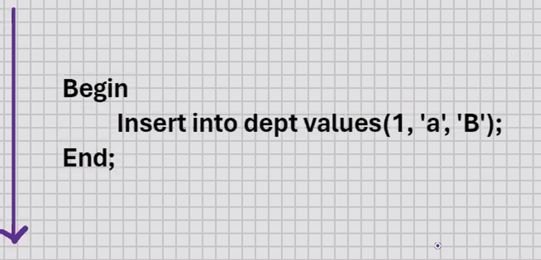
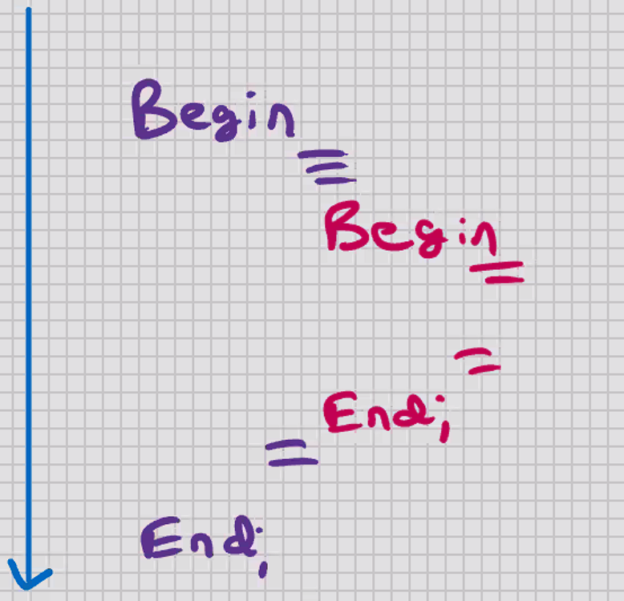
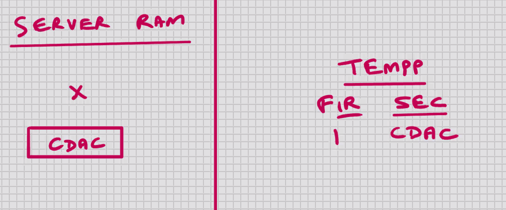
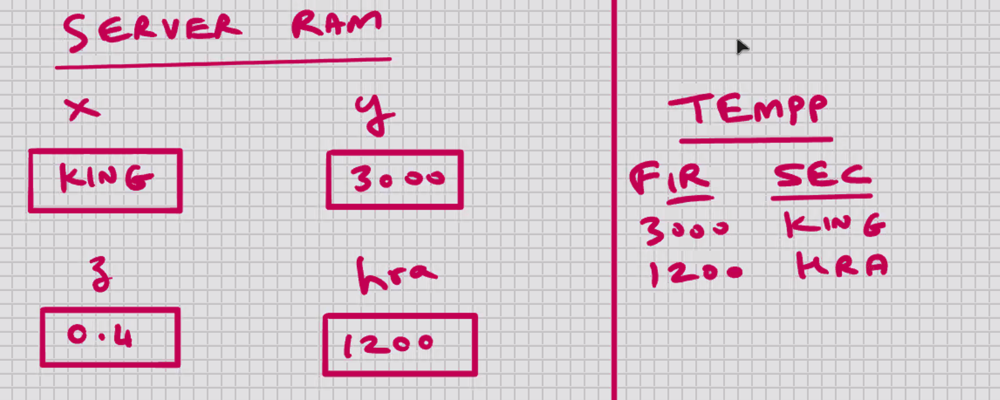
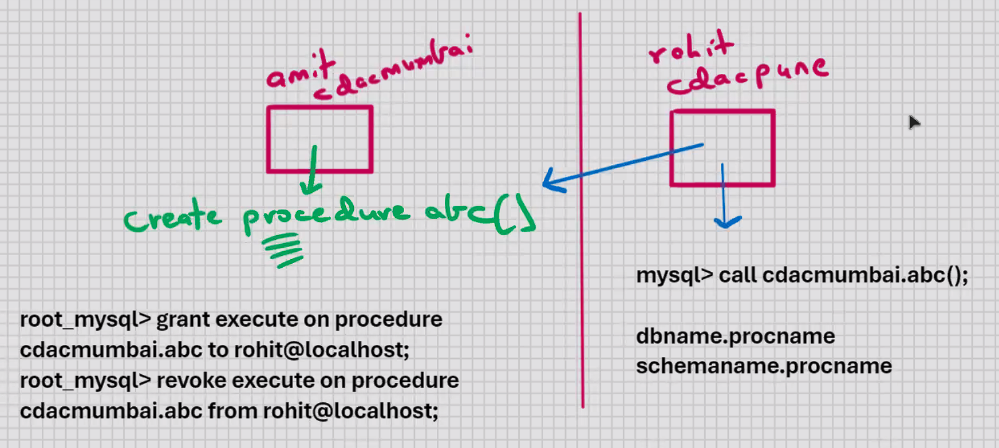
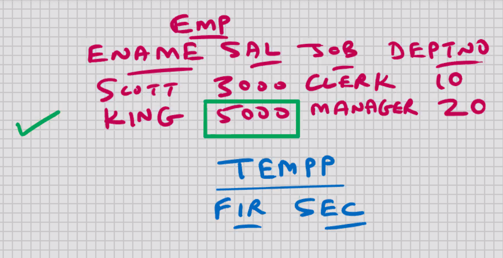
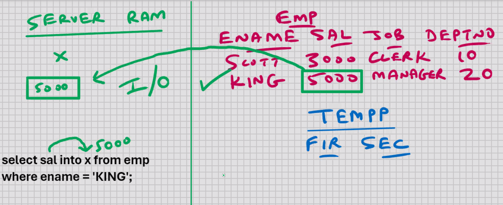
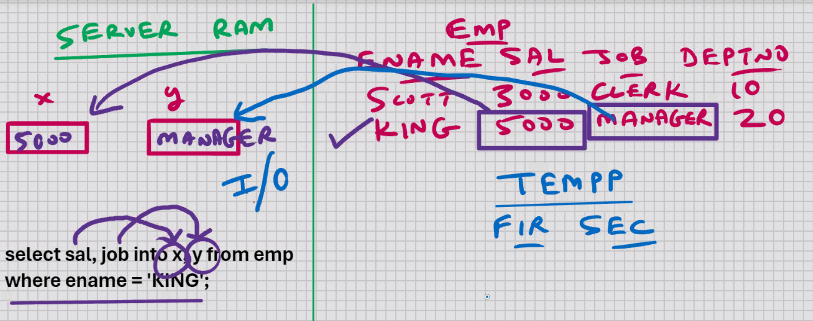
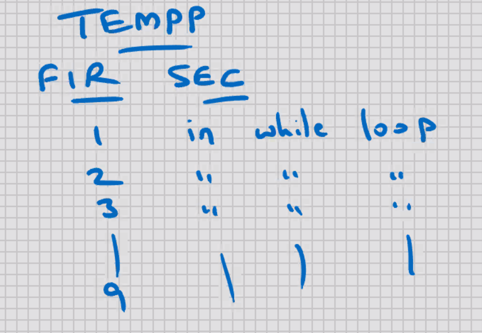

```sql
mysql> select * from emp;
```

- ; is known as delimiter
- it indicates end of command

```sql
mysql> delimiter .

mysql> select * from emp.

mysql> select sal*0.1 from emp.

mysql> delimiter *

mysql> select * from emp*
```

```sql
mysql> delimiter *

mysql> select * from emp*

mysql> delimiter /
mysql> select sal/10 from emp/

mysql> delimiter //

mysql> select * from emp//

mysql> select sal/10 from emp//
```

- Changing the delimiter is known as Personalisation

# MySQL-PL

-- sql is product of IBM, sql is common for all RBDMS

- MySQL Programming Language
- programming language from MySQL
- product of MySQL
- used for database programming
- e.g. e.g. HRA_CALC, TAX_CALC, ATTENDANCE_CALC, etc.

- Every RDBMS has its own native programming language: -

1. Oracle (PL/SQL) -> Procedural Language SQL
   (most popular language for commercial RDBMS) (63%)
2. MS SQL Server (T-SQL) -> Transact SQL
3. MySQL (MySQL-PL) -> MySQL Programming Language (most popular language for open-source RDBMS) (42%)

```sql
mysql> call hra_calc();
```

- used for server-side data rocessing
- MySQL-PL program can be called in MySQL Command Line Client
- MySQL-PL program can be called in MySQL Command Line Client, MySQL Workbench,
  Java, MS, .Net, etc.; can be called through any front-end s/w
- has few 4 GL (supports few OOPS features)
   -- exection is top to bottom.
- MySQL-PL program is commonly referred to as a MySQL-PL block
  
- It is know as Block level language (feature of OOPS)
- Benefits of Block level language:-

1. Modularity
2. Control scope of variables (form of data hiding) (Encapsulation)
3. Efficient error management with the help of exceptions

- Screen input and screen output is not allowed (scanf, printf, etc. not available)
- used ONLY for processing
- can use SELECT statement inside the block but it's not recommended
- SQL commands that are allowed inside MySQL-PL block:- DDL, DML, DQL, DTL/TCL
- DCL commands are not allowed inside MySQL-PL program

workshop--TCP/IP, ipx, decnet, etc.

after 4.46;

```sql
mysql> delimiter //
create procedure abc()
begin
declare x int default 10;
insert into tempp values(x,'inside abc');
end; //
Procedure created.
mysql> delimiter ;
```

- you can declare a variable and assign a value to it simultaneously

```sql
mysql> delimiter //
create procedure abc()
begin
declare x char(15) default 'CDAC';
insert into tempp values(1, x);
end; //
delimiter ;
```

- for char, varchar, date, time, datetime, use ' '
  

```sql
mysql> delimiter //
create procedure abc()
begin
declare x char(15) default 'KING';
declare y float default 3000;
declare z float default 0.4;
declare hra float;
set hra = y*z;
insert into tempp values(y, x);
insert into tempp values(hra, 'HRA');
end; //
delimiter ;
```


INT to FLOAT -> implicit datatype conversion
FLOAT to INT -> rounding takes place

```sql
mysql> delimiter //
create procedure abc(x char(15), y float, z float)
begin
declare hra float;
set hra = y*z;
insert into tempp values(y, x);
insert into tempp values(hra, 'HRA');
end; //
delimiter ;

call abc('KING', 3000, 0.4);
call abc( 'SCOTT', 2500, 0.3);
```

- to make it flexible you can pass parameters to a procedure

```sql
-- Single line comment

/* Multi line
comment */
```

- Comments are known as Internal documentation
- you must have a Comment, minimum every 2 statements

To see which all procedures are created:-

```sql
show procedure status; <- shows all procedures in all databases

show procedure status where db = 'cdacmumbai';

show procedure status where name like 'a%' ;
```

to view the source code of stored procedure:-

```sql
show create procedure abc;
```



after 5.55



```sql
delimiter //
create procedure abc()
begin
declare x int;
select sal into x from emp
where ename = 'KING';
/ * processing, e.g. set hra = x*0.4, etc. * /
insert into tempp values(x, 'KING');
end; //
delimiter;
select <columnname> into <varname> from <table> where ...............;
```



```sql
delimiter //
create procedure abc(y char(15)) --TO MAKE IT FLEXIBLE
begin
declare x int;
select sal into x from emp
where ename = y;
/ * processing, e.g. set hra = x*0.4, etc. * /
insert into tempp values(x, y);
end; //
delimiter;
select <columnname> into <varname> from <table> where ...............;

call abc('KING');
call abc( 'SCOTT');
```

```sql
delimiter //
create procedure abc()
begin
declare x int;
select sal, job into x, y from emp
where ename = 'KING';
/ * processing, e.g. set hra = x*0.4, set y = lower(y), etc. */
insert into tempp values(x, y);
end; //
delimiter

select <col1>, <col2>, ...., <coln> into <var1>, <var2>, ...., <varn>
from <table> where ....................;
```



## Decision making using IF statement

```sql
delimiter //
create procedure abc()
begin
declare x int;
select sal into x from emp where ename = 'KING';
if x > 4000 and x < 5000 then
insert into tempp values(x, 'High sal');
end if;
end; //
delimiter ;

--syntax

if x > 4000 then
....................
....................
....................
....................
end if;
```

```sql
delimiter //
create procedure abc()
begin
declare x int;
select sal into x from emp where ename = 'KING';
if x > 4000
insert into tempp values(x, 'High sal');
else
insert into tempp values(x,'Low sal');
end if;
end; //
delimiter ;

```

```sql
delimiter //
create procedure abc()
begin
declare x int;
select sal into x from emp where ename = 'KING';
if x > 4000
insert into tempp values(x, 'High sal');
elseif x <4000 then
insert into tempp values(x,'Low sal');
else
insert into tempp values(x, 'Medium salt');
end if;
end; //
delimiter ;

-- sytax

if .............................then
.................;
elseif ....................then
...................;
elseif ....................then
...................;
elseif ....................then
...................;
elseif ....................then
...................;
elseif ....................then
...................;
else -- else optinal
.....................;
end if;
```

```sql
6.40
if x > 4000 and x < 6000 then


```

```sql
delimiter //
create procedure abc()
begin
declare x boolean default TRUE;
if x then
insert into tempp values (1, 'Mumbai');
end if;
end; //
delimiter

delimiter // 6.45
create procedure abc()
begin
declare x boolean default FALSE;
if not x then
insert into tempp values (1, 'Delhi');
end if;
end; //
delimiter
```

- boolean is a logical datatype
- if you have a boolean variable, then you can directly use the variablename by itself as a condition for IF statement

```sql
if x > 4000 then
...........................;
else
if x < 4000 then
...................;
else
....................;
end if;
........................;
end if;
```

## Loops

- for repetitive/ iterative processing

---

While loop

- check for some condition before entering the loop

```sql
WHILE expression DO
..............;
..............;
END WHILE;
```

```sql
delimiter //
creatr procedure abc()
begin
declare x int default 1;
while x < 10 do
insert into tempp values(x, 'in while loop');
set x = x+1;  --x++ not possible
end while;
end; //
delimiter ;


delimiter //
creatr procedure abc()
begin
declare x int default 1;
while x < 10 do
insert into tempp values(x, 'in while loop');
/*set x = x+1;*/ --warning never forgot to add termination condition
end while;
end; //
delimiter ;

```



## Repeat Loop (similar to DO WHILE loop):-

- there's no condition to enter the loop
- there's a condition to exit the loop
- it will execute at least once, e.g Outerjoin

```sql
REAPEAT
...............;
...............;
UNTIL expression_is_satisfied -- UNTIL expression
END REAPEAT;
```

```sql
delimiter //
create procedure abc()
begin
declare x int default 1;
repeat
insert into tempp values(x, 'in loop');
set x = x+1;
until x > 5
end repeat;
end; //
delimiter;

```

## Loop, Leave, and Iterate statements

- Leave statement allows you to exit the loop (similar to 'break' statement of 'C' programming)
- Iterate statement allows you to skip the entire code uner it and start a new iteration (similar to 'continue' of 'C' programming)
- Loop statement executes a block of code repeatedly with an additional flexibility of using a loop label

```sql
delimiter //
create procedure abc()
begin
declare x int default 1;
pqr_loop : loop
    if x > 10 then
    leave pqr_loop;
    end if;
set x = x+1;
    if mod(x,2) != 0 then
    iterate pqr_loop;
else
insert into tempp values(x,'inside loop');
end if;
end loop;
end; //
delimiter ;

```

- in deeply nested loops, going from innermost loop to a point outside the outermost loop; leave would be the fastest way of doing it

## MySQL - Global variables

```sql
mysql> set @x= 10; --<- remains in the Server RAM till you exit (end of session)

mysql> select @x from dual;
         10


```

- Global variables can be used in SELECT, INSERT, UPDATE, DELETE statements and MySQL-PL programs also; can be used in front-end s/w also

```sql
mysql> set @x = @x+1;
mysql> select @x from dual;

        11
```

```sql
set @y= 'CDAC';
set @z =  '2024-10-18';
```
