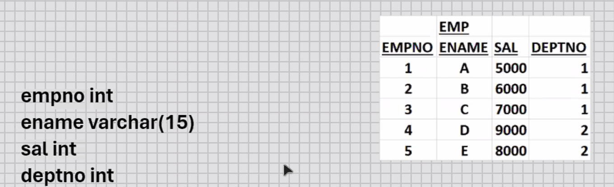
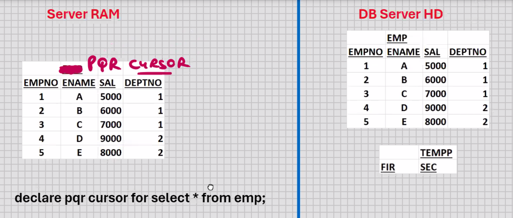
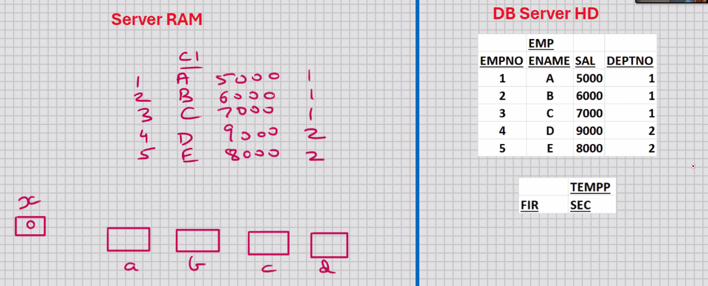
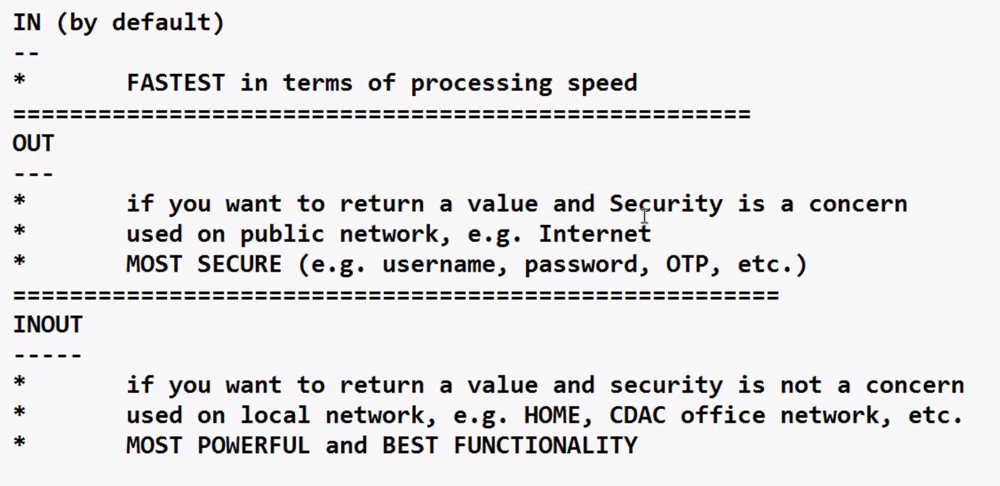

### Day10-18-10-2024

## MySQL-PL - CURSORS (V. Imp) (most Imp)



- present in all RDBMS, some DBMS,and some of the front-end s/w
- cursor is a type of a variable
- cursor can store multiple rows
- cursor is similar to 2D array
- used for storing multiple rows
- used for processing multiple rows
- used for handling multiple rows
- used for storing the data temporarily

```sql
declare x int;
declare hra float;
select sal into x from emp where empno = 1;
set hra = x*0.4;
insert into tempp ............;

declare x int;
declare hra float;
select sal into x from emp where empno = 2;
set hra = x*0.4;
insert into tempp ............;

declare x int;
declare hra float;
select sal into x from emp where empno = 3;
set hra = x*0.4;
insert into tempp ............;

declare x int;
declare hra float;
select sal into x from emp where empno = 4;
set hra = x*0.4;
insert into tempp ............;

declare x int;
declare hra float;
select sal into x from emp where empno = 5;
set hra = x*0.4;
insert into tempp ............;
```

```sql
5.1
declare x int;
declare y int default 1;
declare hra float;
while y < 5 do
        select sal into x from emp where empno
        set hra = x*0.4;

```

```sql
declare pqr cursor for select * from emp;
```



```sql
delimiter //
create procedure abc()
begin
        declare a int;
        declare b varchar(15);
        declare c int;
        declare d int;
        declare x int default 1;
        declare c1 cursor for select * from emp; -- CURSOR DECLARATION/DEFINITION (AT THIS POINT THE CURSOR DOES NOT CONTAIN ANY DATA)
         --c1 is cursor name, cursor is variable
        open c1; -- THIS WILL OPEN THE CURSOR C1, IT WILL EXECUTE THE SELECT STATEMENT, AND IT WILL POPULATE THE CURSOR C1
        while x < 6 do
                fetch c1 into a, b, c, d; -- FETCHES THE NEXT ROW
                / * processing, e.g. set hra = c*0.4, etc. */
                insert into tempp values(a, b);
                set x = x + 1;
        end while;
        close c1; -- THIS WILL CLOSE THE CURSOR C1 AND FREE THE RAM
end; //
delimiter ;

/*
if we use condition while x < 4 do --
then cursor will contain three rows only.
IT IS KNOW AS RANKING REPORT
*/
```

AFTER OPEN C1


- cursor has to be declared AFTER all the variables
- cursor is based on SELECT statement
- the SELECT statement on which the cursor is based could be anything, e.g. select col1, co12, ....., coln, WHERE clause, ORDER BY clause, GROUP BY clause, etc.
- you can have cursor based on join, sub-queries, set operators, view, etc.
- you can have cursor based on computed column, expression, function, etc.
- cursor is a READ_ONLY variable
- data that is present inside the cursor, it cannot be manipulated
- you will have to fetch 1 row at a time into some intermediate variables, and do your processing with those variables
- you can only fetch sequentially (top to bottom)
- YOU CANNOT FETCH BACKWARDS IN MySQL CURSOR
- you can only fetch 1 row a time

```sql
delimiter //
create procedure abc()
begin
        declare a int;
        declare b varchar(15);
        declare c int;
        declare d int;
        declare x int default 1;
        declare c1 cursor for select * from emp;
        open c1;
        while x < 11 do --this will give error cause we have 5 rows and we trying to access 11 row
                fetch c1 into a, b, c, d;
                / * processing, e.g. set hra = c*0.4, etc. */
                insert into tempp values(a, b);
                set x = x + 1;
        end while;
        close c1;
end; //
delimiter ;

/*
while x < 11 do --this will give error cause we have 5 rows and we trying to access 11 row
*/

delimiter //
create procedure abc()
begin
        declare a int;
        declare b varchar(15);
        declare c int;
        declare d int;
        declare x int default 0;
        declare y int;
        declare c1 cursor for select * from emp;
        select count(*) into y from emp;
        open c1;
        while x < y do
                fetch c1 into a, b, c, d;
                / * processing, e.g. set hra = c*0.4, etc. */
                insert into tempp values(a, b);
                set x = x + 1;
        end while;
        close c1;
end; //
delimiter ;


```

- Declare a CONTINUE HANDLER for NOT FOUND event
- NOT FOUND is a cursor attribute; it returns a boolean TRUE value if the last fetch was unsuccessful, and FALSE value if the last fetch was successful

```sql
delimiter //
create procedure abc()
begin
        declare a int;
        declare b varchar(15);
        declare c int;
        declare d int;
        declare y int default 0;
        declare c1 cursor for select * from emp;
        declare continue handler for not found set y = 1;
        open c1;
        cursor c1_loop: loop
        fetch c1 into a, b, c, d;
            if y = 1 then
                leave cursor_c1_loop;
            end if;
                / * processing, e.g. set hra = c*0.4, etc. */
                insert into tempp values(a, b);
            end loop cursor_c1_loop;
            close c1;
end; //
delimiter ;
```

```sql
delimiter //
create procedure abc(dd int)
begin
........................;
declare c1 cursor for select * from emp where deptno = dd;
........................;
end; //
delimiter ;
call abc(1);
call abd(2);


-- another
delimiter //
create procedure abc(dd int, ss int)
begin
........................;
declare c1 cursor for select * from emp
where deptno = dd and sal > ss;
........................;
end; //
delimiter ;

call abc(1,5000);
call abc(2,6000);
```

## Use of Cursors:-

- used for storing/processing multiple rows
- USED FOR LOCKING THE ROWS MANUALLY (imp point)

```sql
--for locking rows
delimiter //
create procedure abc()
begin
        declare c1 cursor for select * from emp for update;
        open c1;
        close cl;
end; //
delimiter ;

--for lock specific rows
delimiter //
create procedure abc()
begin
        declare c1 cursor for select * from emp
        where ............. for update;
        open c1;
        close cl;
end; //
delimiter ;

mysql> call abc();
```

- LOCKS ARE AUTOMATICALLY RELEASED WHEN YOU ROLLBACK OR COMMIT
- You can pass parameters to a procedure

## Parameters are of 3 types:-

## IN (by default)

- Read only
- can pass a constant, variable, and expression
- call by value
- FASTEST in terms of processing speed

```sql
delimiter //
create procedure abc(in y int)
begin
        insert into tempp values(y, 'inside abc');
end; //
delimiter ;

--------------------------------
delimiter //
create procedure pqr()
begin
        declare x int default 10;
        call abc(5); --5
        call abc(x); --10
        call abc(2*x+5); --25
end; //
delimiter ;

call pqr();
```

---

## OUT

- Write only
- can pass variables only
- call by reference
- procedure can return a value indirectly if you call by reference
- if you want to return a value and Security is a concern
- used on public network, e.g. Internet
- MOST SECURE (e.g. username, password, OTP, etc.)

```sql
delimiter //
create procedure abc(out y int)
begin
        set y = 100;
end; //
delimiter ;

----------------------------------------
delimiter //
create procedure pqr()
begin
        declare x int default 10;
        insert into tempp values(x,'before abc');
        call abc(x);
        insert into tempp values(x, 'after abc');
end; //
delimiter ;

call pqr();
```

---

## INOUT

- Read and Write
- if you want to return a value and security is not a concern
- used on local network, e.g. HOME, CDAC office network, etc.
- MOST POWERFUL and BEST FUNCTIONALITY

```sql
delimiter //
create procedure abc(inout y int)
begin
        set y = y*y*y;
end; //
delimiter ;

--------------------------------------------
delimiter //
create procedure pqr()
begin
        declare x int default 10;
        insert into tempp values(x, 'before abc');
        call abc(x);
        insert into tempp values(x, 'after abc');
end; //
delimiter ;

call pqr();
```



## MySQL-PL STORED OBJECTS

- objects that are stored in the database
- e.g. CREATE .... tables, indexes, views, stored procedures
- anything that you do with CREATE command is a stored object

## STORED FUNCTIONS

- routine that returns a value directly and compulsorily
- global functions
- stored in the database
- can be called in MySQL Command Line Client, MySQL Workbench, Java, MS . Net,etc, can be called through any front-end s/w
- stored in the database in the COMPILED FORMAT
- hence the execution will be very fast
- hiding source code from end user
- within the function, all MySQL-PL statements allowed, e.g. variables, cursors, IF statement, sub-blocks, loops, etc.
- stored procedure can call stored function
- stored function can call stored procedure
- one function can call another function
- function can call itself (known as Recursion)
- to make it flexible, you can pass parameters to a function
- OVERLOADING OF STORED FUNCTIONS IS NOT ALLOWED, because it's a stored object; you can create 2 or more functions with the same name even if the NUMBER of parameters passed is different or the DATATYPE of parameters passed is different
- IN parameters ONLY

Stored functions are of 2 types:-

1. Deterministic
2. Not Deterministic

- for the same input parameters, if the stored function returns the same result, it is considered deterministic, and otherwise the stored function is not deterministic
- you have to decide whether a stored function is deterministc or not
- if you declare it incorrectly, the stored function may produce an unexpected result, or the available optimization is not used which degrades the performance

```sql
mysql> call abc();
```

- unlike a stored procedure a stored function cannot be called by itself, because a function returns a value and that value has to be stored somewhere, and therefore the function has to be equated with a variable, or it has to be a part of some expression

```sql
delimiter //
create function abc()
returns int
deterministic
begin
        return 10;
end; //
delimiter ;
```

-->> Read, Compile, Plan, and Store it in the DB in the COMPILED FORMAT (MySql work)

## Function created.

```sql
delimiter //
creat procedure pqr()
begin
        declare x int;
        set x = abc();
        insert into tempp values(x, 'after abc');
end; //
delimiter ;

mysql> call pqr();
```

```sql
drop function abc;

delimiter //
create function abc(y int)
returns int
deterministic
begin
        return y*y;
end; //
delimiter ;


delimiter //
create procedure pqr()
begin
        declare x int;
        set x = abc(10);
        insert into tempp values(x, 'after abc');
end; //
delimiter ;

mysql> call pqr();
```

- STORED FUNCTION CAN BE CALLED IN SELECT STATEMENT
- STORED FUNCTION CAN BE CALLED IN DML COMMANDS ALSO

```sql
mysql> select abc(sal) from emp;
mysql> update emp set sal = abc(sal);
mysql> delete from emp where abc(sal) = 1000000;
```

---

```sql
delimiter //
create function abc(y int)
returns boolean
deterministic
begin
    if y > 5000 then
        return TRUE;
    else
        return FALSE;
    end if;
end; //
delimiter ;

--calling programm
delimiter //
create procedure pqr()
begin
    declare x int;
    select sal into x from emp where ename = 'KING';
    if abc (x) then
            insert into tempp values (x, '> 5000');
    else
        insert into tempp values(x,'<= 5000');
    end if;
end; //
delimiter ;


mysql> call pqr();
```

- function is normally used as a validation routine
- function normally returns a boolean TRUE or FALSE value accordingly some future processing
- If function returns a boolean value, then you can directly use the function name as condtion for IF statement

To see which all functions are created:-

```sql
show function status; --shows all functions in all databases

show function status where db = 'cdacmumbai' ;

show function status where name like 'a%';

To view the source code of stored function:-

show create function abc;
```

To share the function with other users:-

```sql
root_mysql> grant execute on function cdacmumbai.abc to scott@localhost;

scott_mysql> select cdacmumbai.abc() from dual;

root_mysql> revoke execute on function cdacmumbai.abc from scott@localhost;
```
