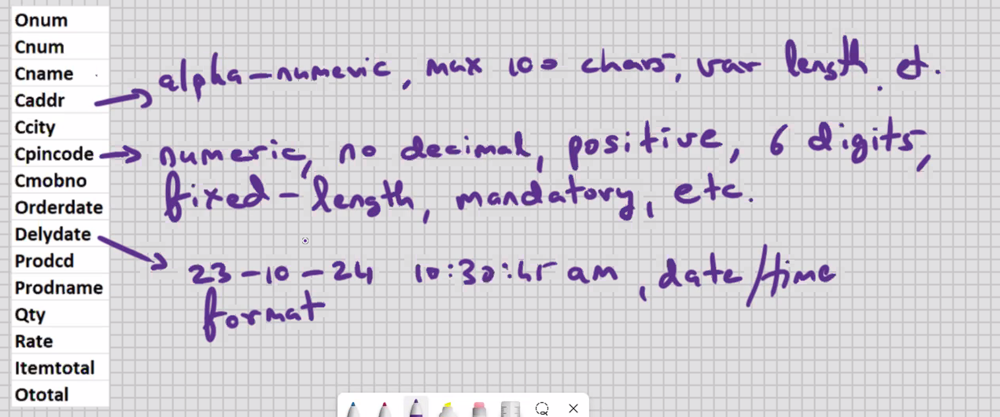
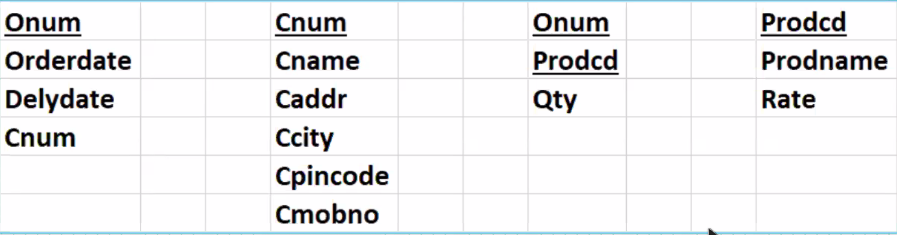

## NORMALISATION

- applicable for RDBMS (e.g. MySQL) and ORDBMS (e.g. Oracle)
- concept of table design
- RDBMS -> 1st to 4th Normal Form
- ORDBMS -> 1st to 9th Normal Form
- what tables to create, structures, columns, datatypes, widths, constraints
- based on User reuirements
- part of Design phase (min 1/6); Coding (25% -33%)
- aim of Normalisation is to have an "efficient" table structure
- aim of Normalisation is to avoid the data redundancy (avoid the unnecessary duplication of data)
- secondary aim of Normalisation is to reduce the problems of insert, update, and delete
- Normalisation is done from an input perspective
- Normalisation is done from a Forms perspective
- VIEW THE ENTIRE APPLICATION ON A PER-TRANSACTION BASIS, AND YOU NORMALISE EACH TRANSACTION SEPARATELY, e.g. CUSTOMER_PLACES_AN_ORDER, CUSTOMER_CANCELS_THE_ORDER,
  GOODS_ARE_DELIVERED, CUSToMER_MAKES_PAYMENT, CUSTOMER_RETURNS_THE_GOODS, etc.

## e.g. CUSTOMER_PLACES_AN_ORDER

Getting ready for Normalisation:-

1. For a given transaction, make a list of fields
2. Ask the Client for some sample data
   
3. With the permission and involvement of Client, strive for atomicity (column is divided into sub-columns, and sub-columns are divided into sub-sub-columns)
4. For every column, make a list of column properties
   
5. Get client sign-off
6. End of client interaction
7. Assign the datatype for each column
8. Assign the width for each column
9. Assign the not null, unique, and check constraints
   
   
10. For all practical purposes, you can have a single table with all these columns
11. Remove the computed columns (e.g. itemtotal, ototal)
12. Key element will be Primary key of this table

- At this point, the data is in Un-Norma1ised Form (UNF)
- Un-Normalised Form -> starting point of Normalisation

## NORMALISATION

1. Remove the Repeating group into a new table
2. Key element will be the Primary key of new table
3. (This step may or may not be required) Add the Primary key of the original table to the new table to give you a composite Primary key

- above 3 steps are to be repeated inifinitely till you cannot Normalise any further
  FIRST NORMAL FORM (FNF) (Single Normal Form) (1NF) -> Repeating groups are removed from table design
- 1 : Many relationship is always encountered here
- DEPT and EMP tables are in First Normal Form
  25%

---

4. Only the tables with Composite Primary key are examined

 5. Those non-key elemehts that are not dependent on the entire Composite Primary key, they are to be removed into a new table

 6. Key element on whicn originally dependent, it is to be added to the new
table, and it will be the Primary key of the new table

- above 3 steps are to be repeated inifnitely till you cannot Normalise any further
  SECOND NORMAL FORM (SNF) (Double Normal Form) (2NF)-> Every column is functionally dependent on Primary key
  FUNCTIONAL DEPENDENCY -> without Primary key, that column cannot function
  67%

---

25% + 67% -> 92% 7. Only the non-key elements are examined for inter-dependencies 8. Inter-dependent columns are to be removed into a new table  
 9. Key element will be the Primary key of the new table, and the Primary key of new table, that column, it is to be retained in the original table for relationship purposes

- above 3 steps are to be repeated inifnitely till you cannot Normalise any further
  THIRD NORMAL FORM (TNF) (Triple Normal Form) (3NF) ->
  Transitive dependencies (inter-dependencies) are removed from table design

Normalisation

- what tables to create, structures, columns, datatypes, widths, constraints
- Primary key is a by-product of Normalisation
  
  Post-Normalisation
- implement Extension columns
- reserve some columns for logs of DML operations
