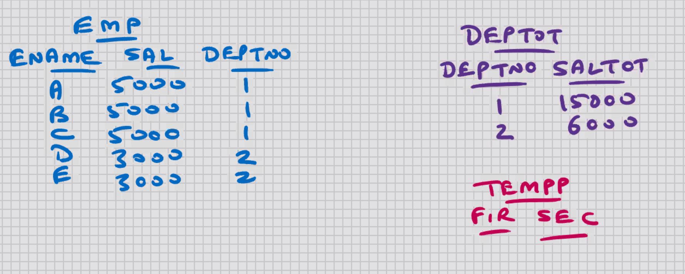
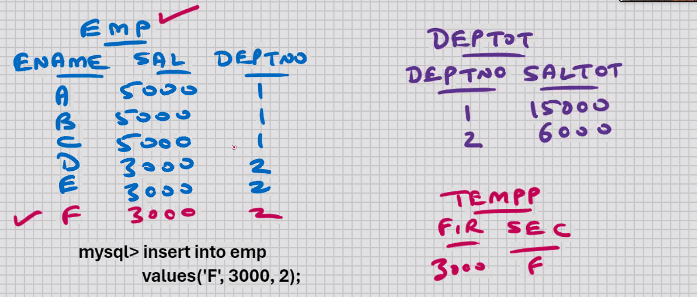
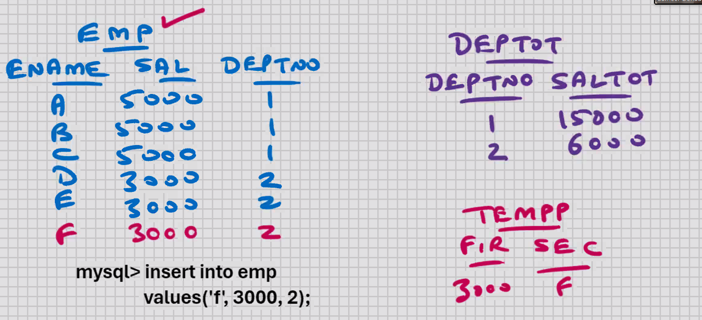
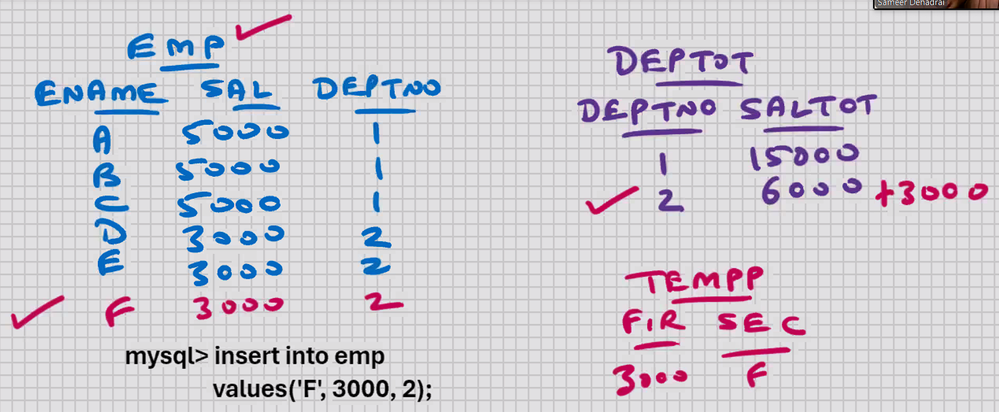
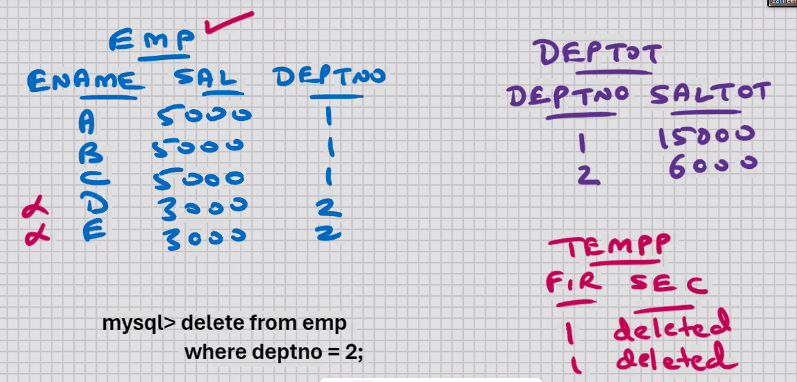
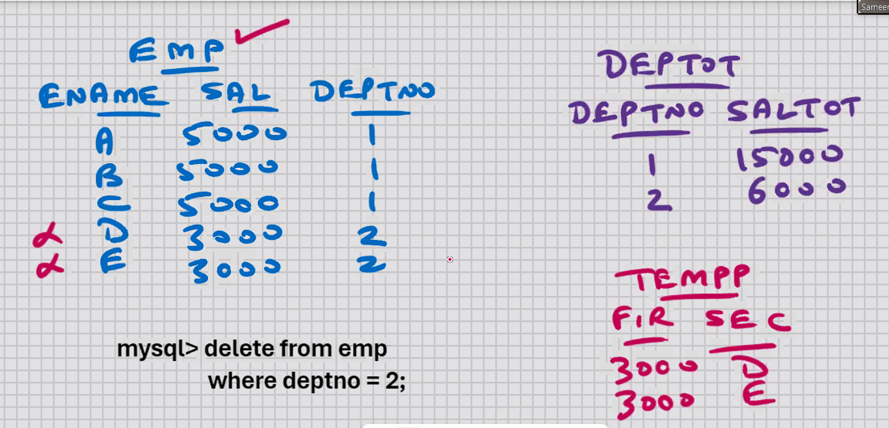
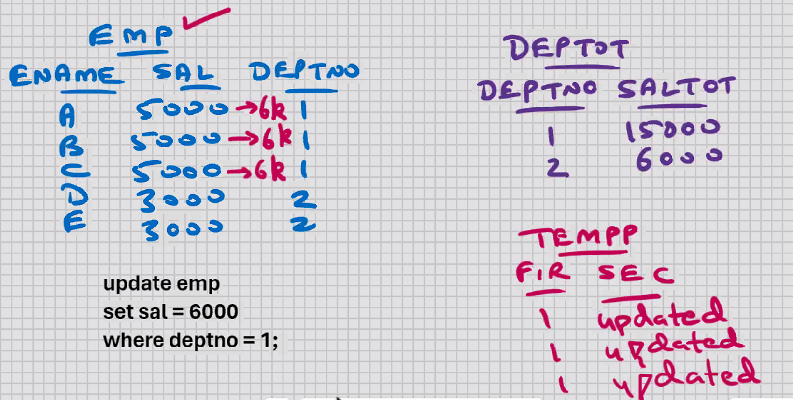
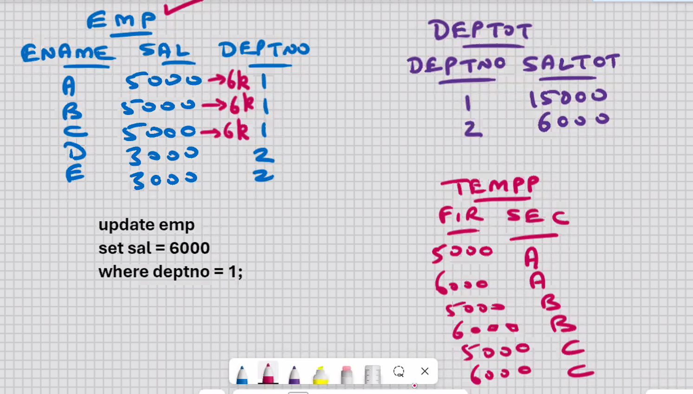
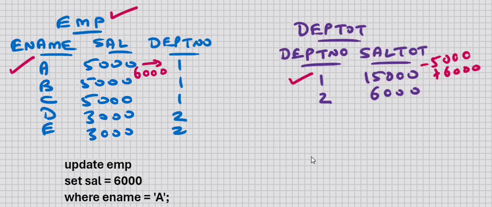
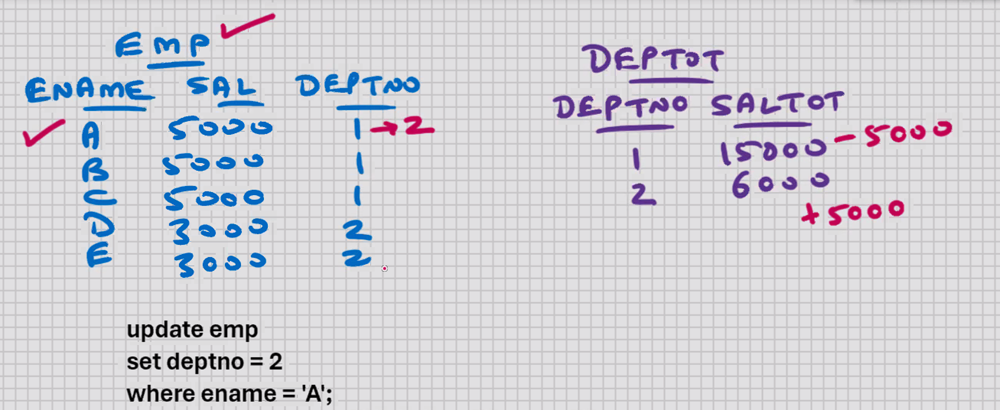

## Day12-20-10-2024

# MySQL - STORED OBJECTS

- objects that are stored in the database
- CREATE..... tables, indexes, views, stored procedures, stored functions
- anything that you do with CREATE command is a stored object

# DATABASE TRIGGERS (V. Imp)



- present in some of the RDBMS
- Routine (set of commands) that gets executed AUTOMATICALLY whenever some EVENT takes place (event means sothing happend)
- Triggers are written on tables

### Events are:-

          Before Insert, After Insert
          Before Delete, After Delete
          Before Update, After Update

```sql

delimiter //
create trigger abc --no brackets here "()"
before insert
on emp for each row
begin
        insert into tempp values(1, ' inserted');
end; //
delimiter ;
```

-->> Read, Compile, Plan, and Store it in the DB in the COMPILED FORMAT

- if INSERT operation on table fails, then it will cause the event to fail, and the trigger changes are automatically Rolled back
- if trigger fails, it will cause the event to fail, and the INSERT operation on table is automatically Rolled back
- YOUR DATA WILL ALWAYS BE CONSISTENT
- within the trigger, all MySQL-PL statements allowed, e.g. variables, cursors, IF statement, loops, sub-blocks, etc.
- whether you Rollback or Commit AFTERWARDS, the data will always be consistent

```sql
delimiter //
create trigger abc --no brackets here "()"
before insert
on emp for each row
begin
        insert into tempp values(1, ' inserted');
        /* commit; */ -- Rollback and Commit not allowed inside the trigger
end; //
delimiter ;
```

- Rollback and Commit not allowed inside the trigger
- Rollback or Commit has to be specified AFTERWARDS, at the end of transaction
- whether you Rollback or Commit AFTERWARDS, the data will always be consistent
- In MySQL, all triggers are at row level (will fire once for each row)
- In MySQL, you can have maximum 6 triggers per table

```sql
delimiter //
create trigger abc
before insert
on emp for each row
begin
    insert into tempp values(new.sal, new.ename);
end; //
delimiter ;
```

- new.ename, new.sal, new.deptno are MySQL created variables



### Uses:-

    maintain logs (audit trails) of insertions

    AFTER INSERT trigger is recommended

    automatic data duplication, data replication, data mirroring, maintain 2 or more copies of table in the event of INSERT

    maintain SHADOW tables in the event of insert

    maintain standby database in the event of insert

    AFTER INSERT trigger is recommended



```sql

delimiter //
create trigger abc
before insert
on emp for each row
begin
    set new.ename = upper(new.ename);
end; //
delimiter ;
```

- new.ename, new.sal, new.deptno are MySQL created variables

### Uses

    Data cleansing BEFORE INSERT

```sql
delimiter //
create trigger abc
before insert
on emp for each row
begin
    if new.deptno = 1 then
        set new.sal = 5000;
    elseif new.deptno = 2 then
        set new.sal = 3000;
    else
        set new.sal = 2500;
    end if;
end; //
delimiter ;

```

### Uses

    Dynamic default values BEFORE INSERT

```sql
delimiter //
create trigger abc
before insert
on emp for each row
begin
                                (6000)  (3000)
    update deptot set saltot = saltot + new.sal
    where deptno = new.deptno;
end; //
delimiter ;
```



### Uses:-

    * auto-updation of related tables
    AFTER INSERT trigger is recommended

```sql
show triggers; --<- shows triggers from all schemas

show triggers from [db_name];

show triggers from cdacmumbai;

drop trigger abc
```

- if you drop the table, then the indexes and triggers are dropped automatically

```sql
select * from information_schema.triggers
where trigger_schema = 'cdacmumbai' ;
```

- if you share your table with the others, the indexes and triggers will be shared automatically
- you can call stored procedures and stored functions inside the trigger

```sql
delimiter //
create trigger pqr
before delete
on emp for each row
begin
    insert into tempp values(1, 'deleted', user(), now(), etc.);
end; //
delimiter ;

```



### Uses:-

    * maintain logs (audit trails) of deletions
    AFTER DELETE trigger is recommended

```sql
delimiter //
create trigger pqr
before delete
on emp for each row
begin
    insert into tempp values(old.sal, old.ename);
end; //
delimiter ;
```



- old.ename, old.sal, old.deptno are MySQL created variables

### Uses:-

    * maintain HISTORY tables in the event of delete

    AFTER DELETE trigger is recommended
    * ON DELETE CASCADE BEFORE DELETE
    * In the above, Set the child rows to NULL, BEFORE DELETE

```sql
delimiter //
create trigger pqr
before delete
on emp for each row
begin
                                        (3000)
    update deptot set saltot = saltot - old.sal
    where deptno = old.deptno;
                    (2)
end; //
delimiter ;
```

### Uses: —

    * auto-updation of related tables
    AFTER DELETE trigger is recommended

```sql
if user() = 'paresh' then
delete from emp where deppto = old.deptno;
end if;
```

- all the triggers are at Server level
- you can perform the DML operations using MySQL Command Line Client, or MySQL Workbench, or Java, or MS .Net, etc. or any front-end s/w, the triggers will execute



```sql
delimiter //
create trigger xyz
before update
on emp for each row
begin
    insert into tempp values(1, 'updated');
end; //
delimiter ;

Trigger created.
```

### Uses:-

    * maintain logs (audit trails) of updations
    AFTER UPDATE trigger is recommended

```sql
delimiter //
create trigger xyz
before update
on emp for each row
begin
    insert into tempp values(old.sal,old.ename);
    insert into tempp values(new.sal,new.ename);
end; //
delimiter ;

Trigger created.
```



- old.ename, old.sal, old.deptno, new.ename, new.sal, new.deptno are MySQL created variables

### Uses:-

    * maintain SHADOW and HISTORY tables in the event of update
    AFTER UPDATE trigger is recommended

#### Cascading triggers -> one trigger causes a second trigger to execute, which in turn causes a third trigger to execute, and so on (imp)

- When all the Cascading triggers are firing, any kind of power failure,
  network failure, etc. ; the entire transaction is automatically Rolled back
- Mutating tables error -> if some Cascading trigger causes one of the previous triggers to execute, then it will not go into infinite loop; you will get an error that the table is undergoing Mutation and the entire transaction is automatically Rolled back

```sql
delimiter //
create trigger xyz
before update
on emp for each row
begin
    update deptot set saltot = saltot - old.sal + new.sal
    where deptno = old.deptno;
end; //
delimiter ;
```



```sql
delimiter //
create trigger xyz
before update
on emp for each row
begin
    if old.sal <> new.sal then
        update deptot set saltot = saltot - old.sal + new.sal
        where deptno = old.deptno;
    end if;
end; //
delimiter ;
```

```sql
delimiter //
create trigger xyz
before update
on emp for each row
begin
    if old.sal <> new.sal or old.deptno <> new.deptno then
        if old.deptno <> new.deptno then
        update deptot set satot = saltot - old.sal
        where deptno = old.deptno;
        update deptot set satot = saltot + new.sal
        where deptno = new.deptno;
    else
        /* if you are UPDATING THE SAL COLUMN ONLY */
        update deptot set saltot = saltot - old.sal + new.sal
        where deptno = old.deptno;
    end if;
end if;
end; //
delimiter ;
```


