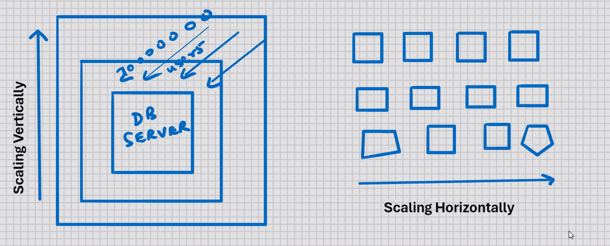
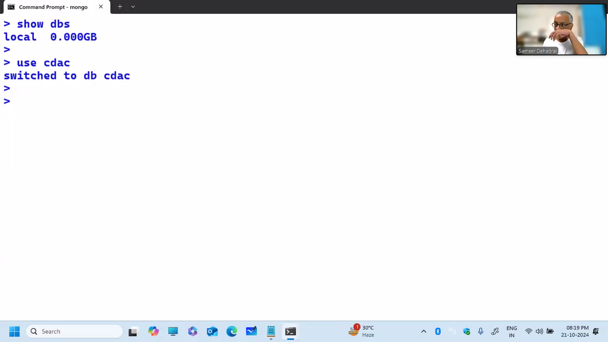
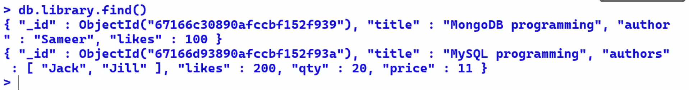

# Introduction to NoSQL

- new technology
- Not Only SQL (SQL is not the only language for database problems)
  (other query languages exist)

## History

- ealier we had DBMS
- mid 1980's Rise of RDBMS

Benefits of RDBMS:-

1. SQL (common for all RDBMS) (all RDBMS can communicate with each other)
2. Data Persistence (RDBMS maintains Read and Write consistency)
3. Complex Transactions
4. Excellent Reporting tools available, e.g. Oracle Reports, Oracle
   Graphics, Actuate, Seagate's Crystal Reports, etc.
5. Integration mechanism across applications
   

## Problems with RDBMS model:-

- Impedance Mismatch -> One logical group of fields in the memory is splattered across multiple tables in the database
  
  Solution: -
- mid 1990's Rise of Object databases, e.g. Oracle, etc.

Development in the world:-

- Early 2000's Rise of the Internet

Problems with Scaling vertically:-

1. Very expensive
2. Very difficult to implement
3. Hardware has a limit

Solution:-

- Scaling Horizontally
- Lots of little boxes sharing the load
  
  

Problem with Sclaing Horizontally:-

- SQL is not designed to work well with a multi-node system

Solution:-

- Grid computing and Cloud Computing
- HAAS (Hardware as a service)
- PAAS (Product)
- SAAS (Software)
- IAAS (Infrasture)
- e.g. Oracle 23c

## Birth of NoSQL

- "NoSQL"
  Twitter Hashtag:-
  #nosql
- NoSQL meetup
- Thursday, 11th June, 2009
- 10am to 5pm
- San Francisco

Attendees :-

- MongoDB
- CouchDB relax
- Project Voldemort A dsitributed database
- Hypertable
- Dynomite
- Cassandra
- Apache HBASE

Definition of NoSQL:-

- no definition of NoSQL

Characteristics of NoSQL:-

1. Open-source
2. Non-relational
3. Cluster-friendly (ability to run large clusters) (horizontal scalibility)
4. Designed for 21st Century Web (high traffic websites)
5. Schema-less

Data models:-

1. Document database

- store documents
- e.g. MongoDB, CouchDB relax, Raven DB

2. Column-family database

- every column is file
- e.g. Cassandra, Apache HBASE

3. Graph database

- store graphs, maps
- Neo4j NoSQL for the Enterprise

4. Key-value database

- based on hashing algorithm
- from the value of the field it will generate the HD address
- designed for fast retrievel
- free HD space has to be allocated in advance
- used for historical data; for Data warehousing applications
- e.g. Project Voldemort A distributed database, riak, redis

---

What is NoSQL?
NoSQL is a type of Database management System

Various Database management Systems:-

1. RDBMS
2. OLAP (Online Analystical Processing)
3. NOSQL

Objectives of NoSQL:-
NoSQL is focused to provide:-

1. Scalability
2. Performance
3. High Availability

| RDBMS              | NoSQL                           |
| ------------------ | ------------------------------- |
| More functionality | Less functionality              |
| Less performance   | More Performance                |
| Tables             | Collections                     |
| Structured data    | Structured and Unstructure data |

NoSQL - What is missing?

1. No Joins support
2. No complex transactions support
3. No constraints support

NoSQL - What is Available?

1. Query language (Other than SQL) ("Not Only SQL")
2. Fast performance
3. Horizontal scalability

When to use NoSQL:-

1. The ability to store and retrieve great quantities of data is important
2. Storing relationhsips between the elements is not important
3. Delaing with growing lists of elements: Twitter posts, Internet server
   logs, Blogs
4. The data is not structured or the structure is changing with time
5. Prototypes or fast applications need to be developed
6. Constraints and validations logic is not required to be implemented in
   the database

When not to use NoSQL:-

1. Complex transactions need to be handled
2. Joins must be handled by the databases
3. Validations must be handled by the databases

MongoDB

- sponsored by 10gen
- JSON-sty1e Documents represented as BSON (Binary JSON)
  
- JavaScript Object Notation
- json.org/bsponspec.org
- Flexible "Schemas"
  

- \_id field
- every document has an \_id field
- equivalent to Primary key of RDBMS

### ObjectlD( "4bface1a2231316ee4fec434")

                timestamp
                    machine id
                        peocess id
                            counter

- \_id lightweigth occupying 12 Bytes of storage
- generated on client end to reduce load on database server

- Many supported platforms/languages
- Drivers for PHP, Perl, C++, .Net, Python, RUby, etc.
- All major OS 32/64 bit
- MongoDB v2.7 is the last version to support 32 bit OS
- MongoDB v3.2 onwards only 64 bit OS is supported

- Download MongoDB
  https : //www.mongodb.org
  https : //www.mongodb.com

Install MongoDB V3.2 for Windows 64 bit

- Run mongoDB Setupt
- Click Next
- Accept the End-User License Agreement
- Next
- Setup Type -> Complete
- Install
- UAC -> Yes (Allow)
- Finish

- MongoDB gets installed in C:\Program Files\mongoDB
- Go to C:\Program Files\MongoDB\Server\3.2\bin folder
- mongod.exe is required to start the database
- mongo.exe is required to start the MongoDB command line
- MongoDB requires a data directory to store all the data

- Create folder C:\MongoDB\Data

- Add C:\Program Files\mongoDB\Server\3.2\bin to the path variable
  of Windows

- To start the database:-

- Go to command prompt
- Go to C:\Program Files\MongoDB\Server\3.2\bin folder
  and type:-
  ....\bin> mongod --dbpath C:\mongoDB\Data

- if your path includes spaces, enclose the entire path is double
  quotes
  
  
  
  
  
  
  
  
  
  
  
  
  
  
  to make it more presentable, we have a pretty method
  > db. library. find() . pretty()
  > 
  > 
  > 
  > 
  > 
