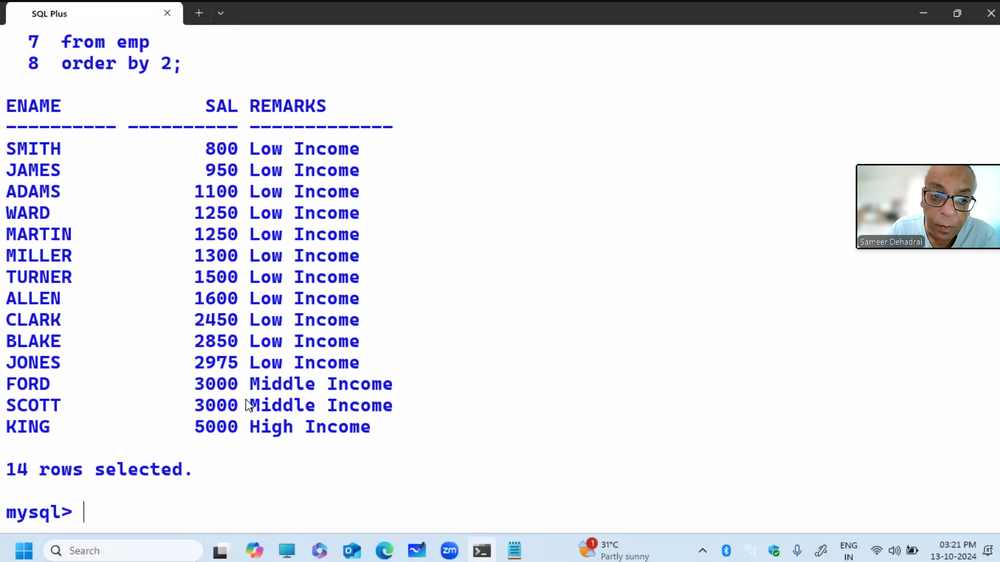

# MySQL - SQL - List Functions (ifnull, greatest)

- independent of datatype

Uses:-
a. to set a lower limit on some value

bonus = 10% sal, min bonus = 300

```sql
select greatest(sal*0.1,300) from emp;

select greatest(sal,3000,4000,5000,10000) from emp;


greatest (val1, val2, val3,....,val255)

greatest (col1, col2, col3,....,col255)

greatest( ' str1', 'str2', 'str3')

greatest( 'date1' , 'date2' , 'date3' , 'date4')

greatest( 'time1' , 'time2 ' , 'time3')

greatest( ' datetime1' , 'datetime2 ' , 'datetime3')


set x= greatest(a,b,c,d);


select least(sa1,3000 from emp;  --returns the smaller of the two

1000
2000
3000
3000
3000
```

Uses: —
a. to set an upper limit on some value

e.g.
cashback = 10% amt, max cashback = 300

```sql
select least(amt*0.1,300) from orders;

select least(sal, 3000, 4000, 5000, 10000) from emp;


least (val1, val2, val3,....,val255)

least (col1, col2, col3,....,col255)

least(num1,num2,num3)

least( ' str1', 'str2', 'str3')

least( 'date1' , 'date2' , 'date3' )

least ( 'time1' , 'time2 ' , 'time3')

least ( ' datetime1' , 'datetime2 ' , 'datetime3')


set x = least(a,b,c,d);
```

# MySQL - SQL - CASE keyword


```sql
select
case
when deptno = 10 then 'Training'
when deptno = 20 then 'Exports'
when deptno = 30 then 'Marketing'
else ' Others '
end
from emp;

Training
Training
Exports
Marketing
Others

select
case
when deptno = 10 then 'Training'
when deptno = 20 then 'Exports'
when deptno = 30 then 'Marketing'
else ' Others '
end "DEPTNAME"
from emp;

DEPTNAME
Training
Training
Exports
Marketing
Others

select
case
when deptno = 10 then 'Training'
when deptno = 20 then 'Exports'
when deptno = 30 then 'Marketing'
end "DEPTNAME"
from emp;

DEPTNAME
Training
Training
Exports
Marketing

- if you don't specify ELSE, and if DEPTNO 40 is present in the table, then it returns a null value

select
case
when deptno = 10 then 'Ten'
when deptno = 20 then 'Twenty'
when deptno = 30 then 'Thirty'
when deptno = 40 then 'Fourty'
end "DEPTNUMBER"
from emp;
```


```sql
if deptno = 10 then HRA = 40% annual
if deptno = 20 then HRA = 30% annual
if deptno = 30 then HRA = 25% annual
else HRA = 20% annual

select deptno, ename, sal, sal*12 "ANNUAL",
case
when deptno = 10 then sal*12*0.4
when deptno = 20 then sal*12*0.3
when deptno = 30 then sal*12*0.25
else sal*12\*0.2
end "HRA"
from emp
order by 1;

if sal < 3000, REMARK = 'Low Income'
if sal = 3000, REMARK = 'Middle Income'
if sal > 3000, REMARK = 'High Income'

select
case
when sign(sal-3000) = 1 then 'High Income'
when sign(sal-3000) = -1 then 'Low Income'
else 'Middle Income'
end "REMARKS"
from emp
order by 2; --order by 2 column
```



# MySQL - SQL - Environment Functions

mysql> use cdacmumbai;

mysql> select database() from dual;

select user() from dual;

show character set;

MySQL - SQL - Group/Aggregate Functions


## Single-Row Functions:-

- operate on 1 row at a time
- Character, Number, Date and Time, List, Environment Functions
- e.g. upper (ename), round(sal), etc.

## Multi-Row Functions:-

- operate on multiple rows at a time
- Group Functions
- e.g. sum(sal)

select sum(sal) from emp;
35000
select internal work

only sal column load in RAM and put in into array AND only total i.e 35000 will send to client, then RAM will free

Assumption, 4th row SAL is null:-


```sql
select sum(sal) from emp; -- NULL VALUES ARE NOT COUNTED BY GROUP FUNCTIONS
26000

select sum(ifnull(sal,0)) from emp;
26000
```

Assumption, 4th row SAL is null:-

```sql
select avg(sal) from emp; --NULL VALUES ARE NOT COUNTED BY GROUP FUNCTIONS
26000/4 - > 6500

select avg(ifnull(sal,0)) from emp;
26000/5 -> 5200
```

Assumption, 4th row SAL is null:-

```sql
select min(sal) from emp;
3000

select min(ifnull(sal,0)) from emp;
0

Assumption, 4th row SAL is null:-

select max(sal) from emp;
8000
```

Assumption, 4th row SAL is null:-

```sql
select count(sal) from emp; --returns a count of number of rows where SAL is not having a null value
4

select count(*) from emp;  --returns a count of total number of rows in the table
5

select count(*) from emp; --how many employee
select count(sal) from emp; --how many geting sallary
select count(*) - count(sal) from emp; --how many not getting salary
```

```sql
select max(sal)/min(sal) from emp;
8000/3000 -> 2.67

select sum(sal)/count(\*) from emp; --FASTER, it goes only one in loop
26000/5

select avg(ifnull(sal,0)) from emp; --SLOW it goes two times in loop first for check null and then cal
26000/5
```

Assumption, 4th row SAL is 9000: -


```sql
select sum(sal) from emp
where deptno = 1;
18000
```


```sql
select avg(sal) from emp
where job = 'C';
6000
```

COUNT-QUERY (counting the number of query hits):-

```sql
select count(\*) from emp
where sal > 7000;
3

sum (column)

avg(column)

min(column) min(sal), min(ename), min(hiredate)

max(column) max(sal), max(ename), max(hiredate)

count(column) count(sal), count(ename), count(hiredate)

count(\*)

stddev(column)

variance(column)
```

## SUMMARY REPORT:-

```sql
select count(\*), min(sal), max(sal), sum(sal), avg(sal) from emp;
```


## Restriction #1:-

- you cannot SELECT column of table alongwith a Group function

```sql
  select count(ename), max(sal) from emp;

select ename, max(sal) from emp; --ERROR
```

## Restriction #2:-

- you cannot SELECT a Single-row function alongwith a Group function

```sql
  select count(ename), max(sal) from emp;

select upper(ename), max(sal) from emp; --ERROR
```

## Restriction #3:-

- you cannot use Group function in the WHERE clause

```sql
  select \* from emp where sal > avg(sal); -- ERROR
```

# MySQL - SQL GROUP BY clause (V. Imp)

- used for grouping
  WHERE clause -> used for searching
  ORDER BY clause -> used for sorting
  FOR UPDATE clause -> used for locking the rows manually
  GROUP BY clause -> used for grouping

```sql
select sum(sal) from emp;
35000

select sum(sal) from emp
Where deptno = 1;

sum(sal) deptwise:-
select deptno, sum(sal) from emp
group by deptno;
```

5:30 afterward

```sql
SELECT clause -> select deptno, sum(sal)
FROM clause -> from emp
GROUP BY clause -> group by deptno
```

## Rule #1:-

Besides the Group function Whichever column is present in SELECT clause, it has to be present in GROUP BY clause

```sql
select deptno, sum(sal) from emp; -- ERROR
```


```sql
select deptno, sum(sal) from emp
group by deptno;
```


## Rule #2:-

Whichever column is present in GROUP BY clause,it may or may not be present in SELECT clause

```sql
select sum(sal) from emp
group by deptno;
```


```sql
select deptno, sum(sal) from emp
group by deptno;

select deptno, max(sal) from emp
group by deptno;

select deptno, min(sal) from emp
group by deptno;

select deptno, avg(sal) from emp
group by deptno;

select deptno, count(\*) from emp
group by deptno;
```


- 2D query -> any SELECT statement with a GROUP BY clause is known as a 2D query, because you can plot a graph from the output

- MS Excel, Oracle Graphics, Oracle Apex, etc.

```sql
select deptno, sum(sal) from emp
where sal > 7000 --used to retrieve the rows
group by deptno;
```

- WHERE clause is specified BEFORE the GROUP BY clause

```sql
select deptno, sum(sal) from emp
where sal > 7000 and sal < 10000
group by deptno;

select deptno, sum(sal) from emp
where job = 'C'
group by deptno;

select job, sum(sal) from emp
group by deptno;

select deptno, job, sum(sal) from emp
group by deptno, job;
```

- no upper limit on the number of columns in GROUP BY clause

```sql
 select........................

group by city, state, city;
```

- if you have a large number of rows in the table, and if you have a large number of columns in GROUP BY clause, then the SELECT statement will be very slow, because that much sorting has to take place in Server RAM

- if you have 1 column in GROUP BY clause -> 2D query
- if you have 2 columns in GROUP BY clause -> 3D query
- if you have 3 columns in GROUP BY clause -> 4D query
  etc.

known as Multi-dimensional queries (also known as Spatial queries)

```sq;
select deptno, job, sum(sal) from emp
group by deptno, job;

select job, deptno, sum(sal) from emp
group by job, deptno;
```


outer loop should with less number of iterration and inner should be more for faster excution in any lang in nested loop


```sql
select
group by city, country, district, state; --SLOW

select
group by country, state, district, state; --FAST

select sum(sal), deptno, job from emp
group by job, deptno;
```

- the position of columns in SELECT clause and the position of columns in GROUP BY clause need not be the same

- the position of columns in SELECT clause will determine the position of columns in the output; this you will write as per User requirements

- the position of columns in GROUP BY clause will determine the sorting order, grouping order, summation order, and hence the speed of processing; this you will write as per count(distinct(columname))

```sql
select count(distinct deptno), count(distinct job) from emp;

select deptno, sum(sal) from emp
group by deptno;
```


```sql
select deptno, sum(sal) from emp
group by deptno
having sum(sal) > 17000;
```


- WHERE clause is used for searching
- searching takes place in DB Server HD
- WHERE clause is used to restrict the rows
- WHERE clause used to retrieve the rows from DB Server HD to
  Server RAM
- HAVING clause works AFTER the summation is done

```sql
select deptno, sum(sal) from emp
where sal > 7000
group by deptno;

select deptno, sum(sal) from emp
group by deptno
having sal > 7000; <-ERROR
```


- Whichever column is present in SELECT clause, it can be used in HAVING clause

```sql
select deptno, sum(sal) from emp
group by deptno
having deptno = 1; --WILL WORK BUT IT IS INEFFICIENT INSTEAD SHOULD HAVE USED WHERE DEPTNO = 1
```

- It's recommended that only the Group functions should be used in HAVING clause

```sql
select deptno, sum(sal) from emp
group by deptno
having sum(sal) > 17000;

select deptno, sum(sal) from emp
group by deptno
having sum(sal) > 17000 and sum(sal) < 25000;
```

1. Rows retrieved from DB Server HD to Server RAM
2. Sorting deptwise
3. Grouping deptwise
4. Summation deptwise
5. HAVING clause
6. ORDER BY clause

6.55

- ORDER BY clause is the LAST clause in SELECT statement

```sql
select ..............from...........
where.............
group by...................
having.................
order by................;
```

## MATRIX REPORT:-

```sql
select deptno, count(\*), min(sal), max(sal), sum(sal) from emp
group by deptno
order by 1;
```


In Other RDBMS:- 7.4

```sql
select deptno, sum(sal) from emp
group by deptno;

select deptno, sum(sal) from emp
group by deptno;
```


```sql
select max(sum(sal)) from emp -- NESTING OF GROUP FUNCTIONS IS SUPPORTED BY ORACLE
group by deptno;
```


In MySQL:-

```sql
- select sum(sal) sum_sal from emp
group by deptno;
```


```sql
select max(sum_sal) from
(select sum(sal) sum_sal from emp
group by deptno) abcd;
```


