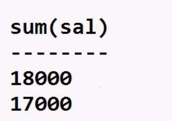

14-10-2024

# MySQL - SQL - Sub-queries

- Nested queries (Query within query) (SELECT within SELECT)
  

```sql
select min(sal) from emp;
3000

select ename, min(sal) from emp; --error
```

Display the ENAME who is receiving SAL = min(sal):-

```sql
select ename from emp  --main query (parent) (outer)
where sal = (select min(sal) from emp);  --sub query (child) (inner)
```

`Kiran`

after 5.44

```sql
select ename from emp
where sal =
(select min(sal) from emp
where deptno =
(select.....................));
```

- max upto 255 levels for sub-queries (this limit of SQL can be exceeded with the help of Views)
- JOIN IS FASTER THAN SUB_QUERY, because when you write a Join you solve the problem using one SELECT statement, whereas with sub-queries you require 2 more SELECT statements
- the more the number of SELECT statements, the slower it will be

Display the 2nd largest SAL:-

```sql
select max(sal) from emp
where sal <
(select max(sal) from emp);
```

Display all the rows who belong to the same DEPTNO as 'Thomas' :-

```sql
select * from emp
where deptno =
(select deptno from emp
where ename = 'Thomas' ) ;
```

---

```sql
select * from emp
where job =
(select job from emp
where ename= 'Kirun');
-- first brackect () will be solve
```

---

## Using sub-query with DML commands:-

In Other RDBMS:-

```sql
delete from emp
where deptno =
(select deptno from emp
where ename = 'Thomas');

update emp set sal = 10000
where job =
(select job from emp
where ename = 'Kirun');
```

- ABOVE 2 COMMANDS WILL NOT WORK IN MySQL
- IN MySQL YOU CANNOT UPDATE OR DELETE FROM A TABLE FROM WHICH YOU ARE CURRENTLY SELECTING

---


## Using sub-query with DML commands:-

Solution for MySQL:-

```sql
delete from emp
where deptno =
(select abcd.deptno from
(select deptno from emp
where ename = 'Thomas') abcd);

update emp set sal = 10000
where job =
(select pqr.job from
(select job from emp
where ename = 'Kirun') pqr);
```

## Multi-row sub-queries (sub-query returns multiple rows):-

Display all the rows who are receiving a SAL = any of the Managers:-

```sql
select * from emp
where sal = any
(select sal from emp
where job = 'M' ) --- subquery return (8000,9000)

select * from emp
where sal in
(select sal from emp
where job = "M" ) --- subquery return (8000,9000)
```

```sql
select * from emp
where sal >=
(select min(sal) from emp
where job = 'M');
--( 8000)
```

To make it work faster:-

1. Try to solve the problem using a Join, because Join is faster than sub-query
2. Try to reduce the number of levels for sub-queries
3. Try to reduce the number of rows returned by sub-query

---


Assumption, 3rd row SAL is 13000:-

```sql
select * from emp
where sal > all
(select sal from emp
where job = "M" ) -- subquery wiil return (8000,9000......)

select * from emp
where sal >
(select max(sal) from emp
where job = 'M' ) --(9000)
```

6.44
AND-> ALL logical
OR -> ANY logical
IN-> logical OR

Display all the rows who are receiving a SAL > ALL the Managers

- Assumption 3rd row SAL is 3000

Using sub-query in the HAVING clause:-
Display the DNAME that is having max(sum(sal)):-

```sql
select deptno, sum(sal) from emp
group by deptno;
```



```sql
select sum(sal) sum_sal from emp
group by deptno;
```


```sql
select max(sum_sal) from
(select sum(sal) sum_sal from emp
group by deptno) abcd;
```


```sql
select deptno, sum(sal) from emp
group by deptno
having sum(sal) =
(select max(sum_sal) from
(select sum(sal) sum_sal from emp
group by deptno) abcd);
```


```sql
select dname, sum(sal) from emp, dept
where dept.deptno = emp.deptno
group by dname
having sum(sal) =
(select max(sum_sal) from
(select sum(sal) sum_sal from emp
group by deptno) abcd);
```


- INLINE VIEW -> if you have a sub-query in the FROM clause, then
  it's known as Inline View

after 7.30

## Correlated sub-query (using the EXISTS operator)

- this is the exception when sub-query is faster than Join

Display the DNAMEs that contain employees:-

Solution #1:-

```sql
select deptno from emp;
```

1
1
1
2
2

```sql

select distinct deptno from emp;
```

1
2

```sql
select dname from dept
where deptno = any
(select distinct deptno from emp); --(1,2)
```

TRN
EXP

```sql
select dname from dept
where deptno in
(select distinct deptno from emp);
--(1,2)
```

TRN
EXP

```sql
select dname from dept
where deptno not in
(select distinct deptno
from emp)
```

MKTG

## Disphay the DNAMEs that contain employees:-

Solution #2:-

```sql
select dname from emp, dept
where dept.deptno = emp.deptno;
```

TRN
TRN
TRN
EXP
EXP

```sql
select distinct dname from emp, dept
where dept.deptno = emp.deptno;
```

TRN
EXP

---

## Correlated sub-query (using the EXISTS operator)

- this is the exception when sub-query is faster than Join
- if you have a Join alongwith DISTINCT, to make it work faster use Correlated sub-query (use the EXISTS operator)

Solution #3:-

```sql
select dname from dept where exists  --TRUE/FALSE
(select deptno from emp
where dept.deptno = emp.deptno) ;
```

TRN
EXP

- first the main query is executed
- for every row returned by main query, it will run the sub-query once
- sub-query returns boolean TRUE value or FALSE value
- if sub-query returns TRUE value, then main query is eventually executed for that row
- if sub-query returns FALSE value, then main query is not executed for that row
- unlike earlier, we do not use DISTINCT here, therefore no sorting takes place in Server RAM; this speeds it up
- unlike a Join, the number of full table scans is reduce; this further speeds it up

```sql
select dname from dept where not exists
(select deptno from emp
where dept.deptno = emp.deptno);
```

MKTG
