# DBT Day7-15-10-2024

## MySQL - SQL - Set Operators

- foundation of RDBMS based on set theory
- founder of RDBMS -> Dr. E. F. Codd (1968)

  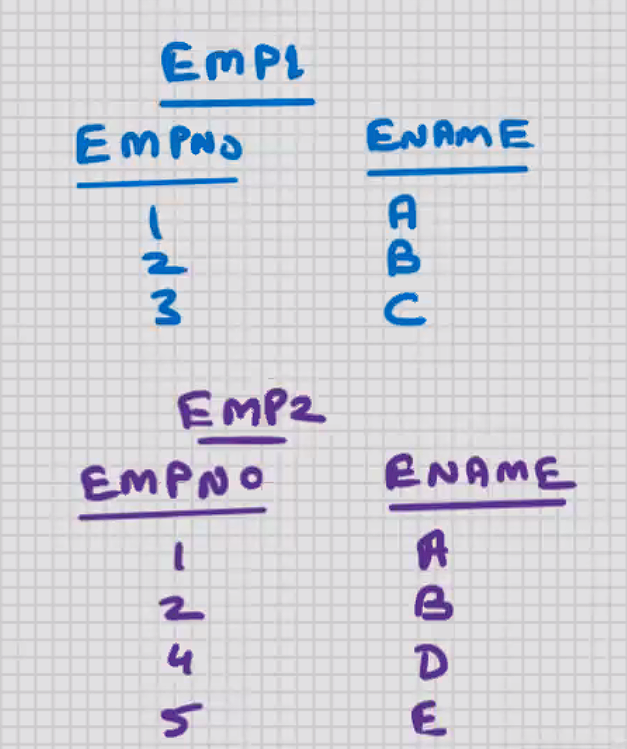

```sql
select empno, ename from emp1
union
select empno, ename from emp2;
```

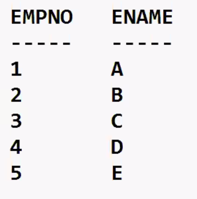

union -> will combine the output of both the SELECT statements and it will suppress the duplicates

- structure of both the SELECT statements has to be the same
- number of columns in both and the correspoinding datatypes have to match
- the columnnames may be different

```sql
select empno1, ename from emp1
union
select empno2, ename from emp2;
```

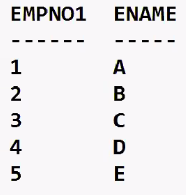

```sql
select empno1, ename from emp1
union
select empno2, ename from emp2
order by 1; --this for whle command it is for final output, for both command output
```

```sql
select empno1, ename from emp1
union all
select empno2, ename from emp2
order by 1;
```

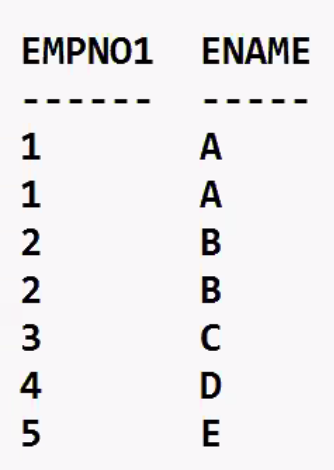

- union all will combine the output of both the SELECT statements and the duplicates are not suppressed

```sql
select empno1, ename from emp1
intersect
select empno2, ename from emp2
order by 1;
```

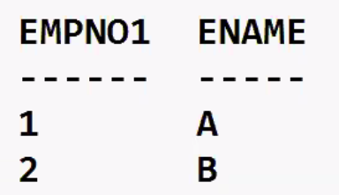

- intersect will return what is common in both the SELECT statements and the duplicates are suppressed

```sql
select empno1, ename from emp1
except
select empno2, ename from emp2
order by 1;
```

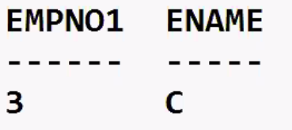

- except will return what is present in the first SELECT statement and not present in the second SELECT statement and the duplicates are suppressed

- union, union all, intersect, except

```sql
select............
union
(select.............
intersect
select.............)
union
(select...............
union all
select.............)
except
select..........
order by x;
-- all are of equal precedence but with the brackets () first..
```

- max upto 255 SELECT statements this limit of SQL can be exceeded with the help of Views

```sql
select job from emp where deptno = 10
intersect
select job from emp where deptno = 20
```


```sql
select job from emp where deptno = 10
except
select job from emp where deptno = 20
```

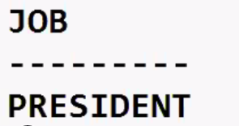

## MySQL - Pseudocolumns

- fake columns (virtual columns)
- it's not a column of the table, but you can use it in SELECT statement

e.g.

1. Computed columns (ANNUAL = sal\*12)
2. Expressions (NET_EARNINGS = sal+comm-tax)
3. Function-based columns (AVG_SAL = avg(sal), R_SAL = round(sal,-3))

RDBMS supplied Pseudocolumns:-

```sql
select ename, sal from emp;
```

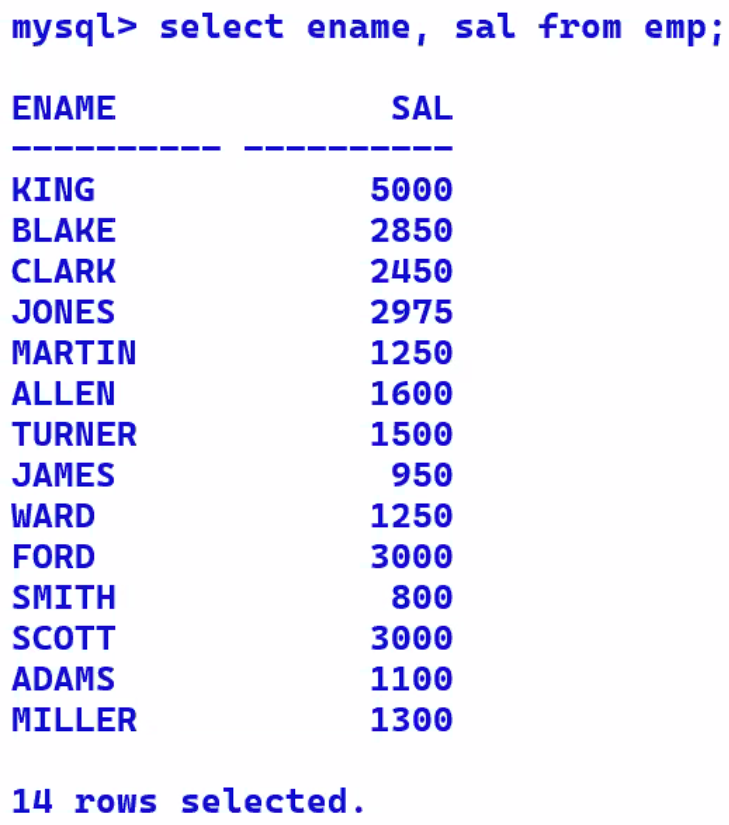

ROWID

- ROWID stands for Row identifier
- Rowid is not a column of the table, but you can use it in SELECT statement
- Rowid is the row address
- Rowid is the actual physical memory location in the DB Server HD where that row is located
- When you SELECT from a table, the order of rows in the output depends on the row address; it will always be in ascending order of Rowid
- Rowid is a fixed-length encrypted string of 18 characters
- When you INSERT a row, the address (Rowid) is constant for the life of the row
- When you UPDATE a row, if the row length is decreasing, then the address (Rowid) is will not change
- When you UPDATE a row, if the row length is increasing, and if free space is not available, then the address (Rowid) is will change
- No two rows of any table in the entire DB Server HD can have the same Rowid
- Rowid works as an unique identifier for every row in the database
- Rowid is used by MySQL to distiguish between two rows in the DB Server HD

```sql
select rowid, ename, sal from emp;
```

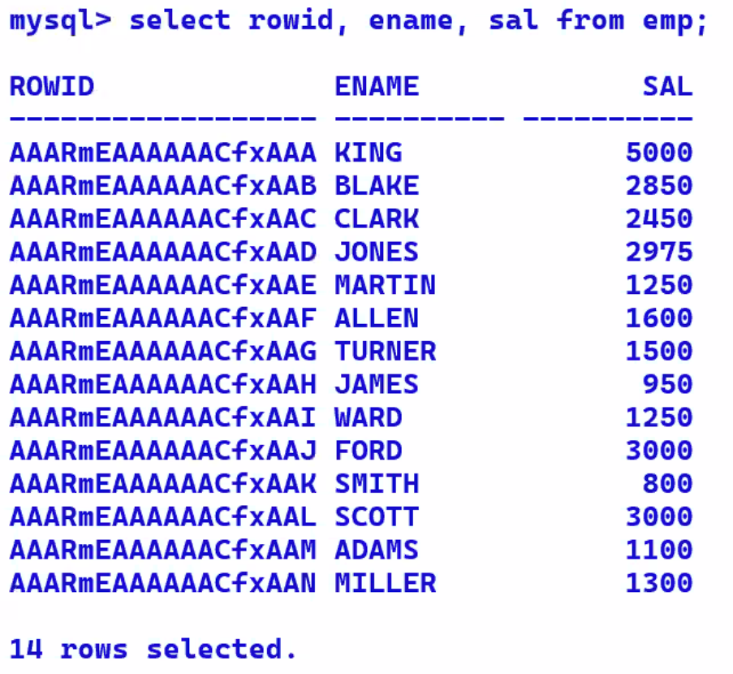
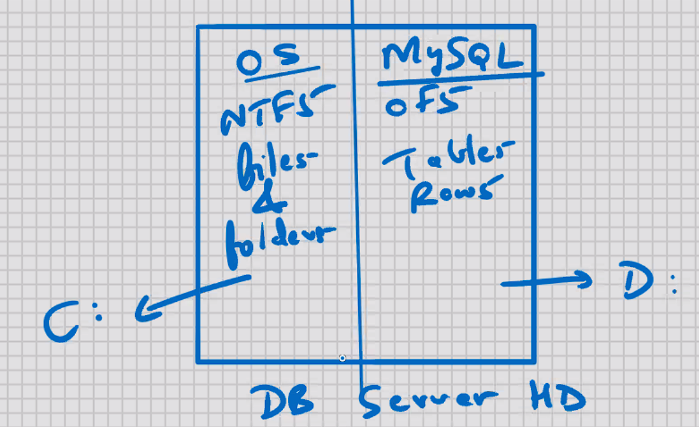

Practical use

- You can use Rowid to UPDATE or DELETE the duplicate rows
- Rowid is used internally by MySQL:-

1. Row locking
2. to manage the indexes
3. to manage the cursors
4. to distinguish between two rows
5. row management
6. etc

## MySQL - INDEXES

- Indexes are present in all RDBMS, all DBMS, and some of the programming languages also
- to speed up the searching operations (for faster access)
- to speed up the SELECT statement with a WHERE clause
- In MySQL, the indexes are automatically invoked by the system as and when required
- In MySQL, the indexes are automatically updated by the system for all the DML operations
- duplicate values are stored in an index

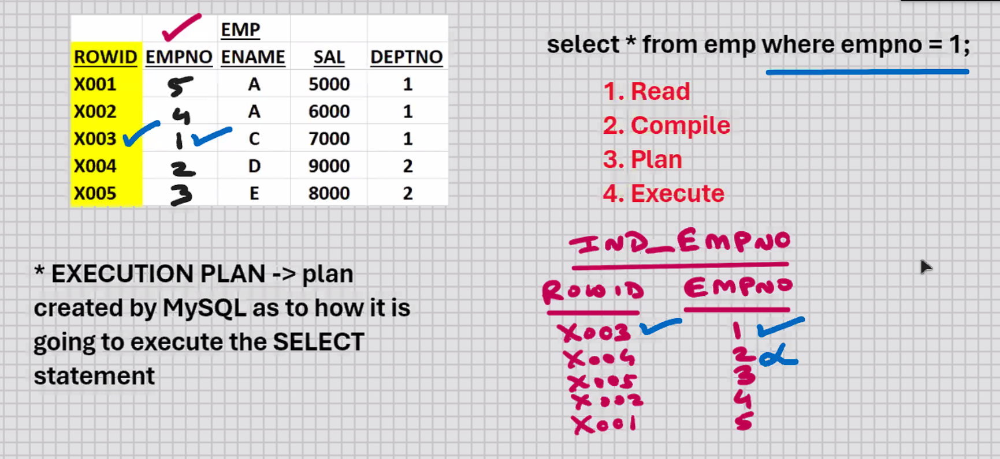
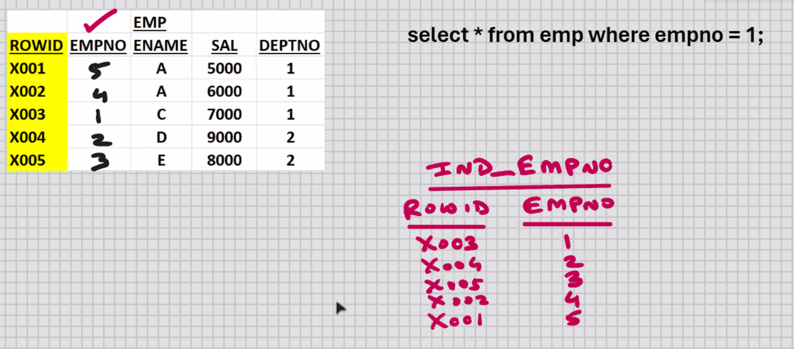

- no upper limit on the number of indexes per table
  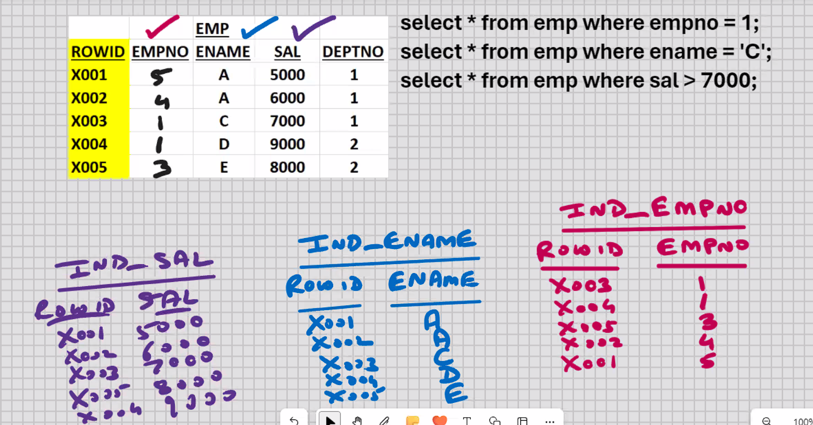
- larger the number of indexes, the slower would be the DML operations
- cannot index text and blob columns
- null values are not stored in an index
- if you have 2 or more INDEPENDENT columns in the WHER clause, then create separate indexes for each column; MySQL will use the necessary indexes as and when required

```sql
select * from emp where
select * from
emp where
select * from
emp
where empno
= 2 and sal
empno = 2;
sal > 5eee;
> 5eee;
```

- COMPOSITE INDEX -> combine 2 or more INTER-DEPENDENT columns together in a single index

```sql
select * from emp
where deptno = 1 and empno = 1;
```

- INDEX KEY -> column or set of columns on whose basis the index has been created
  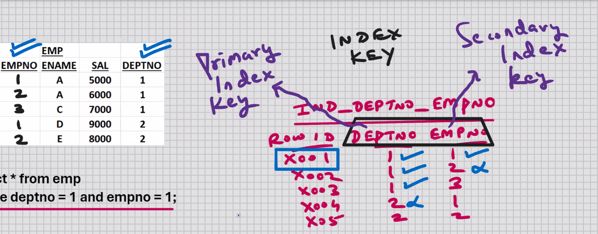
- In MySQL, you can combine upto 32 columns in a Composite index
  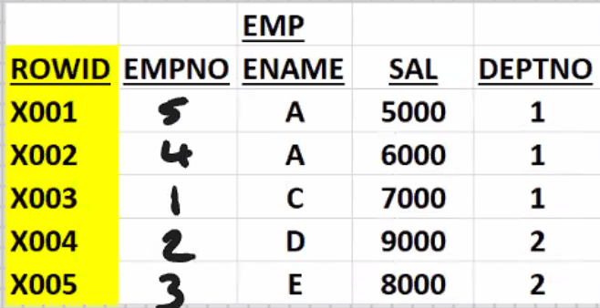

## MySQL - INDEXES

Conditions when an index should be created:-

- to speed up the SELECT statement with a WHERE clause
- if SELECT retrieves < 25% of table data

```sql
select * from emp where empno = 1;
select * from emp where empno = 5;
select * from emp where empno < 2;
select * from emp where empno > 1; -- - NOT RECOMMENDED
```

- Primary key and Unique columns should always be indexed

```sql
select * from emp where ename ='A';
select * from emp where empno = 1;
```

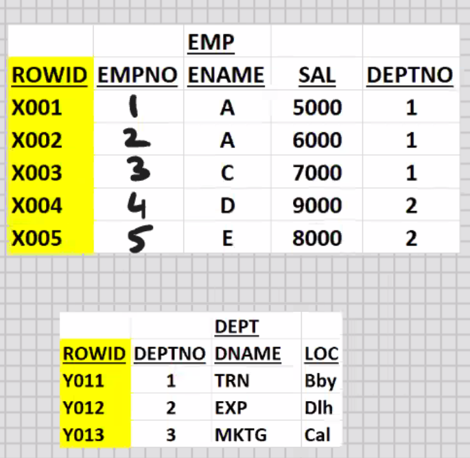

- Common columns in join operations should always be indexed

```sql
select dname, ename from emp, dept
where dept.deptno = emp.deptno;
```

```sql
create index indexname on table(column); --syntax
create index i_emp_empno on emp(empno);
create index i_emp_ename on emp(ename);
create index i_emp_sal on emp(sal);
```

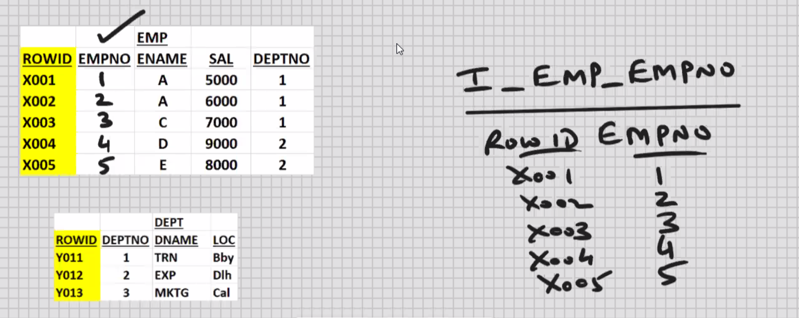

- to see which all indexes are created for specific table:-

```sql
show indexes from emp;
```

- To see all indexes on all table in the database:-

```sql
use information_schema;
select * from statistics;
```

- To drop the index:-

```sql
drop index i_emp_empno on emp;
```

```sql
create index i_emp_empno on emp(empno desc);
create index i_emp_deptno_empno on emp(deptno, empno);
create index i_emp_deptno_empno on emp(deptno desc,empno);
create index i_emp_deptno_empno on emp(deptno desc,empno desc);
```

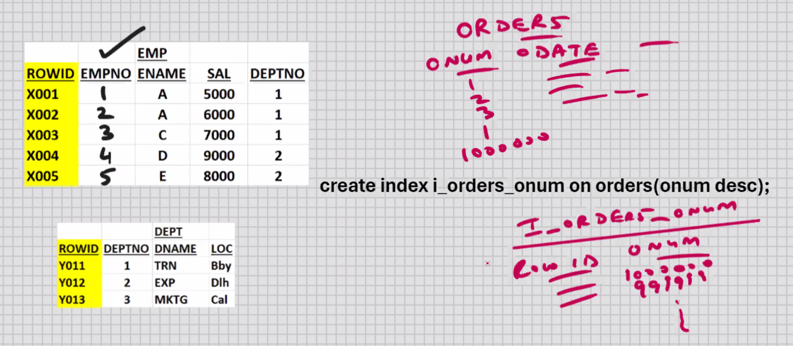

```sql
create unique index i_emp_empno on emp(empno); --performs one extra function, it won't allow to INSERT/UPDATE duplicate value in EMPNO
```

- at the time of creating the unique index, if you already have duplicate values in EMPNO, then MySQL will not allow you to create the unique index

```sql
drop index ........;
drop table emp;
```

- if you drop the table/column, then associated indexes are dropped automatically

## Types of Indexes:-

1. Normal Index
2. Normal Composite Index
3. Unique Index
4. Unique Composite Index
5. Clustered Index
6. Non-clustered Index
7. Covering Index
8. Full-Text Index
9. Filtered Index
10. Spatial Index
11. XML Index
12. Hash Index
13. Bitmap Index
14. Index-Organized Table
15. Table and Index Partitioning
16. Global and Local Indexes
17. Index on Abstract Columns
18. etc.
