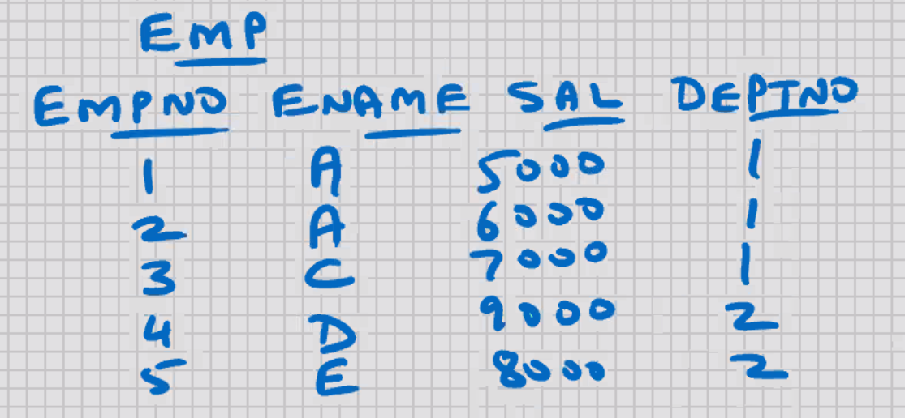
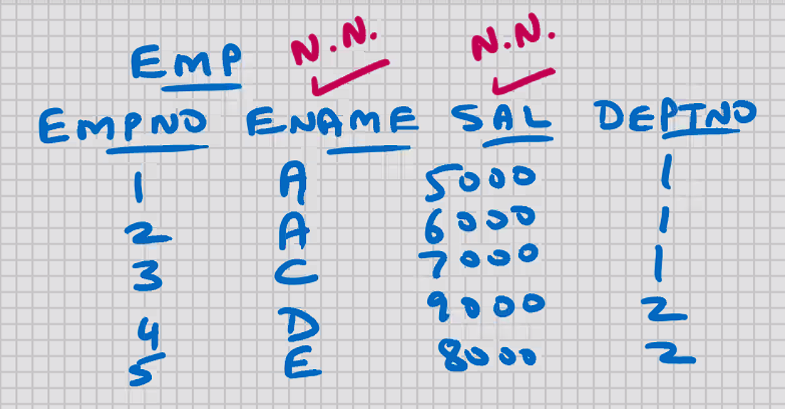
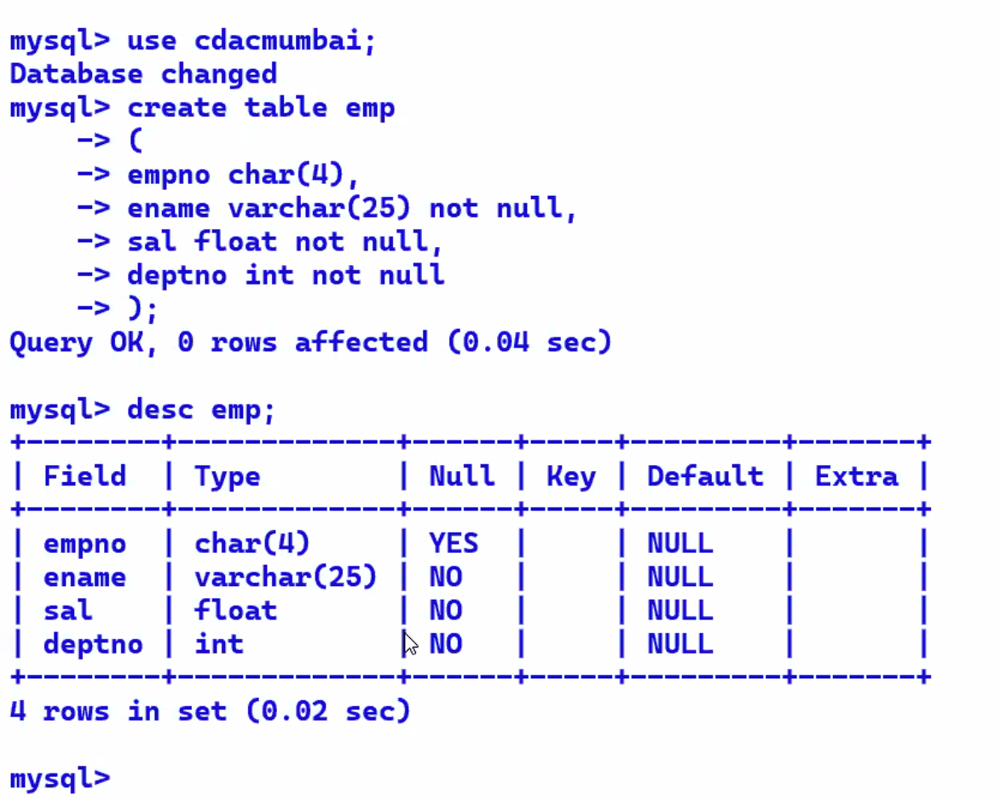
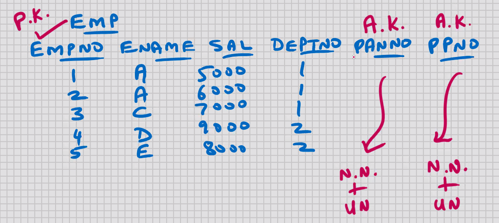

# MySQL - SQL - CONSTRAINTS



- limitations/ restrictions imposed on a table

## PRIMARY KEY

- key is another word for column
- Primary column
- column or set of columns that uniquely identifies a row
  e.g. EMPNO
- duplicate values are not allowed; it has to be unique
- null values are not allowed; this is a mandatory column
- it's recommended that every table should have a Primary key; it helps from a long-term perspective
- purpose of Primary key is row uniqueness; with the help of Primary key column you can distinguish between 2 rows of a table
- Text and Blob cannot be Primary key; they store upto 4gb data
- Unique index is automatically created for Primary key column (because Primary key is the best column for searching)
- COMPOSITE PRIMARY KEY -> combine 2 or more columns together to serve the purpose of Primary key; preferably they should be inter-dependent columns
- In MySQL, you can combine upto 32 columns in a Composite Primary key ( in oracle 16 )
- if you have a Composite Primary key, then a Composite Unique Index is automatically created
- YOU CAN HAVE ONLY 1 PRIMARY KEY PER TABLE
- CANDIDATE KEY -> is not a constraint
- CANDIDATE KEY -> is a definition
- CANDIDATE KEY -> is a column that is Primary key in-waiting
- CANDIDATE KEY - > besides the Primary key, any other column in the table that could serve the purpose of Primary key, is a good canidate for Primary key, is known as Candidate key
- Steps for identifyiing Primary key:-

1. Identify some key column and make it the Primary key of your table
2. If you cannot identify some key column, then try to implement Composite Primary key
3. If this is not possible, then you add an extra column to the table to serve the purpose of Primary key

- SURROGATE KEY -> is not a constraint
- SURROGATE KEY-> is a definition
- SURROGATE KEY -> When an extra column to the table to serve the purpose of Primary key, then such a Primary key is known as Surrogate key
- Primary key is the best column for searching, and with CHAR datatype the searching and retrieval is very fast; therefore for Surrogate key the CHAR datatype is recommended

```sql
(
create table emp
empno char(4) primary key,
ename varchar(25),
sal float,
deptno int
);

mysql> insert into emp values( '5', 'F', 5000, 2); -- ERROR
mysql> insert into emp values( null, 'F', 5000, 2); -- ERROR
```

- all constraints are at Server level; you can perform the DML operations using MySQL Command Line Client, or MySQL Workbench, or Java, or MS .Net, etc., any other front-end s/w, the constraints will always be valid (this feature is known as DATA INTEGRITY)

```sql
select * from information_schema.table_constraints;

select * from information_schema.table_constraints
where table_schema = 'cdacmumbai';

select * from information_schema.key_column_usage
where table_name ='emp';
```

- unique index automatically created

```sql
show indexes from emp;
```

to drop the primary key constraint:-

```sql
alter table emp drop primary key;
```

to add Primary key to an existing table:-

```sql
alter table emp add primary key(empno);
```

To change the Primary key column:-

- Drop the existing Primary key constraint & alter table & then we can add
  new primary key constraint

```sql
(
create table emp
empno char(4) ,
ename varchar(25),
sal float,
deptno int,
primary key(deptno, empno) -- <- Composite Primary key
);

show indexes from emp;

alter table emp drop primary key;

alter table emp add primary key(deptno, empno);
```

Constraints are of 2 types:-

1. Column level constraint

- constraint specified on one column

2. Table level constraint

- Composite
- constraint specified on combination of 2 or more columns
- has to be specified at the end of the table structure

## NOT NULL constraint



- null values are not allowed
- duplicate values are allowed
- always a column level constraint

```sql
create table emp
(
empno char(4),
ename varchar(25) not null,
sal float not null,
deptno int not null
);
```

Entity Integrity -> Primary key
Referential Integrity -> Foreign key
Domain Integrity -> Datatype, e.g. int, char(10), etc.

- In MySQL, nullability is a part of the datatype
- to see the not null columns:-

```sql
    desc emp;
```



To drop the not null constraint:-

```sql
alter table emp modify ename varchar(25) null;
```

To add the not null constraint to existing table:-

```sql
alter table emp modify ename varchar(25) not null;
```

## UNIQUE

- duplicate values are not allowed
- null values are allowed
- can INSERT any number of null values, but no duplicate values
- unique index automatically created
- text and blob cannot be unique
- In MySQL, you can combine upto 32 columns in a composite unique
- YOU CAN HAVE ANY NUMBER OF UNIQUE CONSTRAINTS PER TABLE, UNLIKE PRIMARY KEY

```sql
create table emp
(
empno char(4),
ename varchar(25),
sal float,
deptno int,
mob_no char(15) uniqlue, -- column level constraint
unique (deptno, empno)   -- table level constraint
);

select * from information_schema.table_constraints;

select * from information_schema.table_constraints;
where table_schema = 'cdacmumbai';

select * from information_schema.key_column_usage
where table_name = 'emp' ;
```

```sql
show indexes from emp;

`mob_no
deptno
`
```

- Unique constraint is also an index, so to drop it:-

```sql
drop index mob_no on emp;
drop index deptno on emp;
```

To add unique constraint to an existing table:-

```sql
alter table emp add constraint u_emp_mob_no unique(mob_no);
```

constraint u_emp_mob_no -> constraint constraintname
constraint u_emp_mob_no -> optional

- column level constraint can be specified at table level (end of structure), but a table level composite constraint can never be specified at column level
- most developers prefer this, it make the CREATE table command more Readable
- column level constraint can be specified at table level (end of structure), except for the not null constraint which is always a table level constraint and therefore the syntax will not support you from specifying it at table level

---

- 1 column can have more than 1 constraint
  e.g.
  primary key and foreign key
  not null and unique
  etc.

Solution for candidate key:-
not null constraint + unique index
OR
not null constraint + unique constraint

- with the help of above logic, indirectly you can have multiple Primary keys in the table; one directly, the remaining indirectly



ALTERNATE KEY -> is not a constraint
ALTERNATE KEY -> is a definition
ALTERNATE KEY -> for the Candidate key column, if you give it a Not null constraint + unique index/constraint, then it becomes an Alternative to Primary key, then such a Canidate key column is known as Alternate key

SUPER KEY -> is not a constraint
SUPER KEY -> is a definition
SUPER KEY -> if you have 1 or more Alternate keys in the table, then the
Primary key is also known as Super keyl

## Primary key, Not null, Unique
