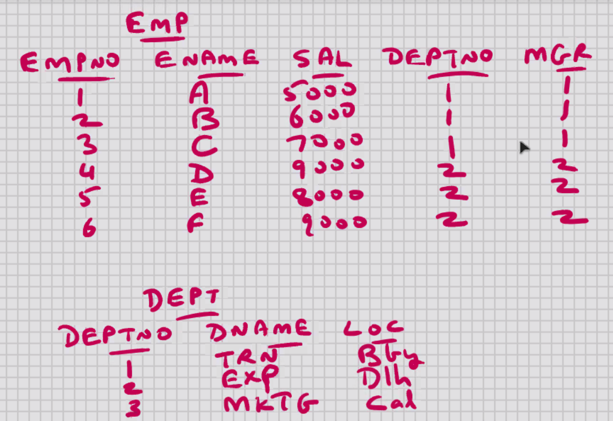
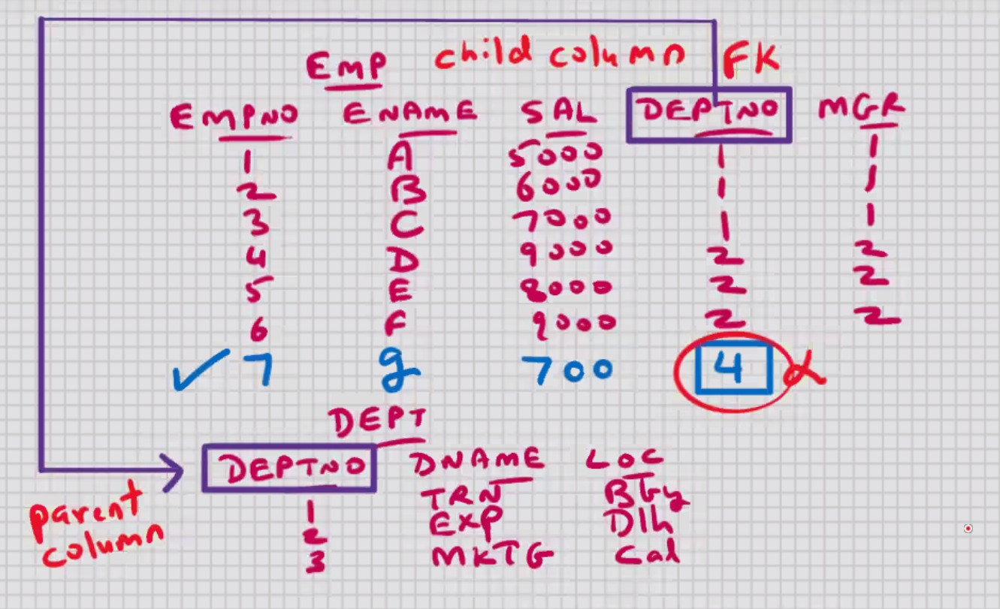
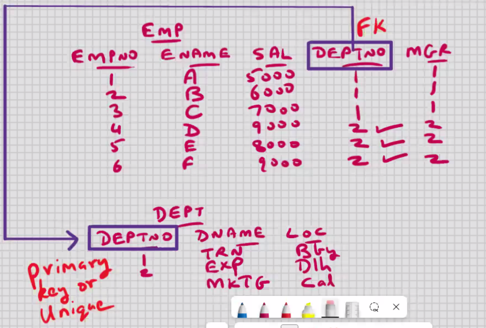
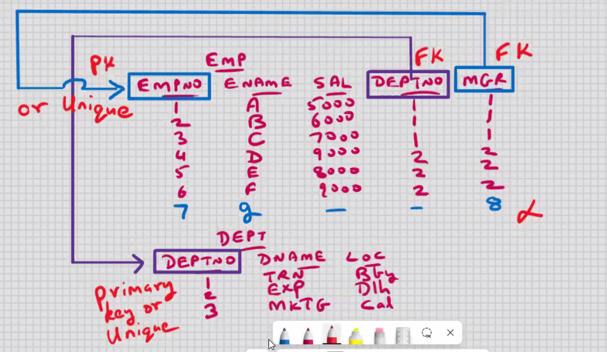
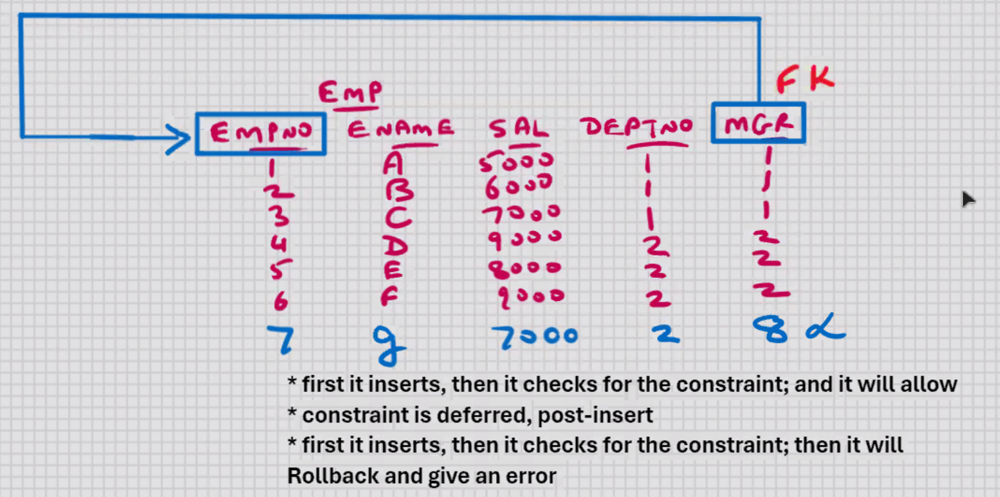
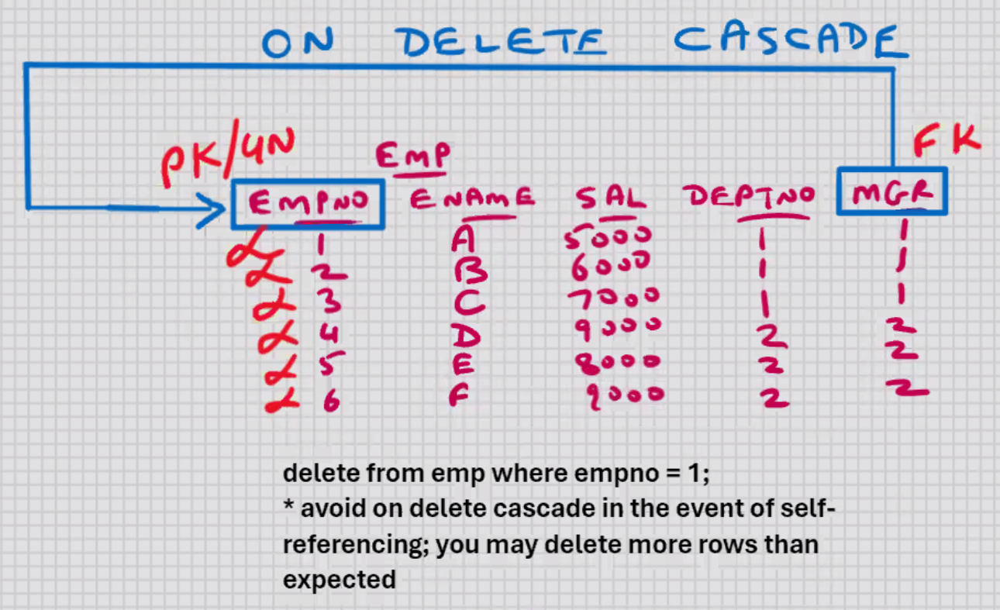

# FOREIGN KEY



## FOREIGN KEY

- Foreign column (column that is coming/derived from elsewhere)
- column or set of columns that references a column or set of columns of some table
  
- Foreign key constraint is specified on the child column (not the parent column)
  
- Parent column has to be Primary key or Unique (this is a pre-requisite for Foreign key)
- Foreign key will allow duplicate values
- Foreign key will allow null values also
  
- Foreign key may reference column of same table also (known as self-referencing) (parent column and child column both are present in the same table)

```sql
create table dept
(
deptno int primary key,
dname varchar(15),
loc varchar(10)
);


create table emp
(
empno char(4) primary key,
ename varchar(25),
sal float,
deptno int,
mgr char(4),
constraint fk_emp_deptno foreign key(deptno)
references dept(deptno),
constraint fk_emp_mgr foreign key(mgr)
references emp(empno)
);
```

constraint fk_emp_deptno -> optional
constraint fk_emp_mgr -> optional

```sql
select * from information_schema.table_constraints;

select * from information_schema.table_constraints
where table_schema = 'cdacmumbai';

select * from information_schema.key_column_usage
where table_name = 'emp';


alter table emp drop foreign key fk_emp_deptno;

alter table emp add foreign key(deptno) references dept(deptno);

```

To disable the foreign key constraint:-
for current connection:-

```sql
set foreign_key_checks = 0; -- to desable
set foreign_key_checks = 1; -- to enable
```

for all connections:-

```sql
set global foreign_key_checks = 0;
set global foreign_key_checks = 1;
```

- you cannot delete the parent row when child rows exist

```sql
delete from dept where deptno = 2;
```

```sql
create table emp
(
empno char(4) primary key,
ename varchar(25),
sal float,
deptno int,
mgr char(4),
constraint fk_emp_deptno foreign key(deptno)
references dept(deptno) on delete cascade,
constraint fk_emp_mgr foreign key(mgr)
references emp(empno)
);
```

- on delete cascade -> if you delete the parent row, then MySQL
  will automatically delete the child rows also

```sql
delete from dept where deptno = 2;
```

To retain the child rows:-

```sql
update emp set set deptno = null where deptno = 2;
delete from dept where deptno = 2;
```

```sql
create table emp
(
empno char(4) primary key,
ename varchar(25),
sal float,
deptno int,
mgr char(4),
constraint fk_emp_deptno foreign key(deptno)
references dept(deptno) on delete cascade on update cascade,
constraint fk_emp_mgr foreign key(mgr)
references emp(empno)
);
```

on update cascade -> if you UPDATE the parent column, then MySQL will automatically update the child rows also

```sql
update dept set deptno = 4 where deptno = 2;
```



