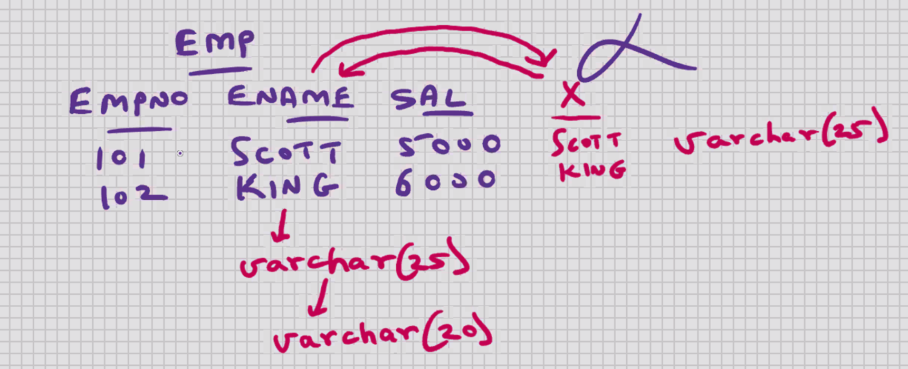
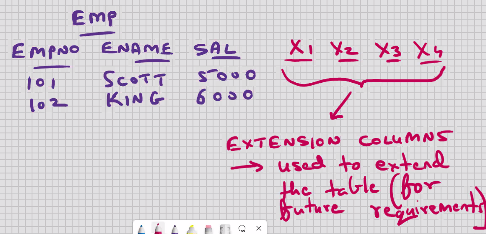
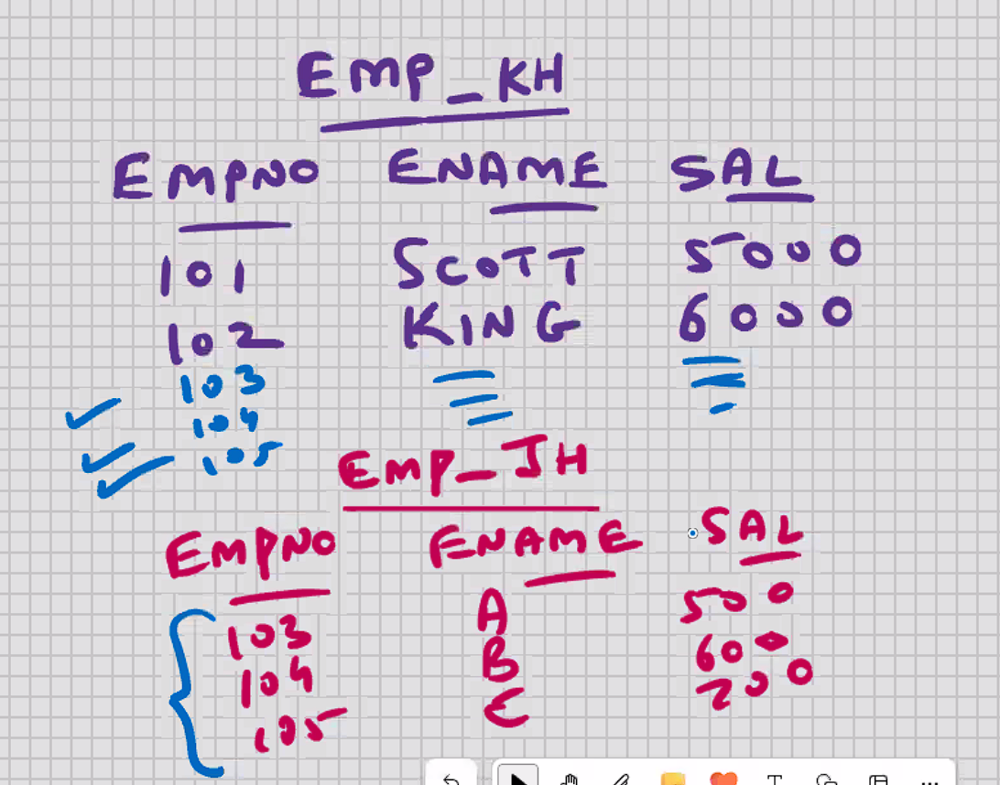
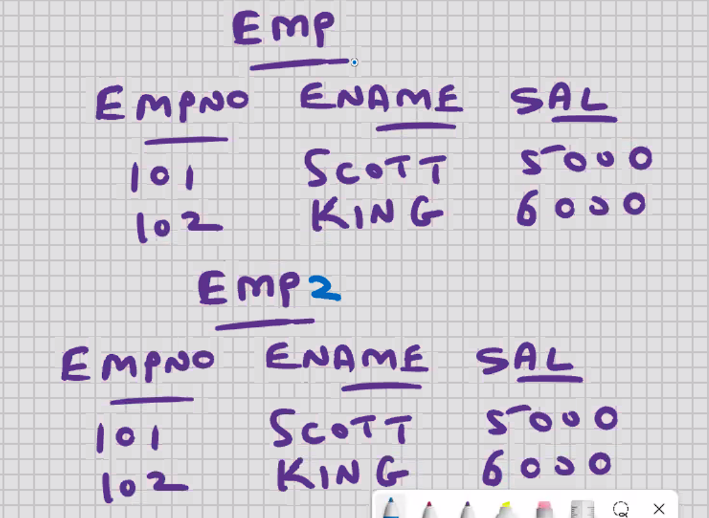
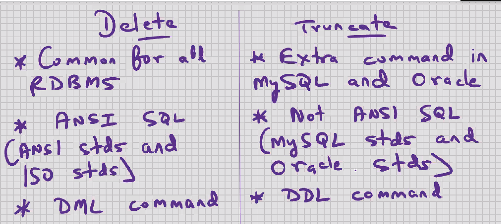
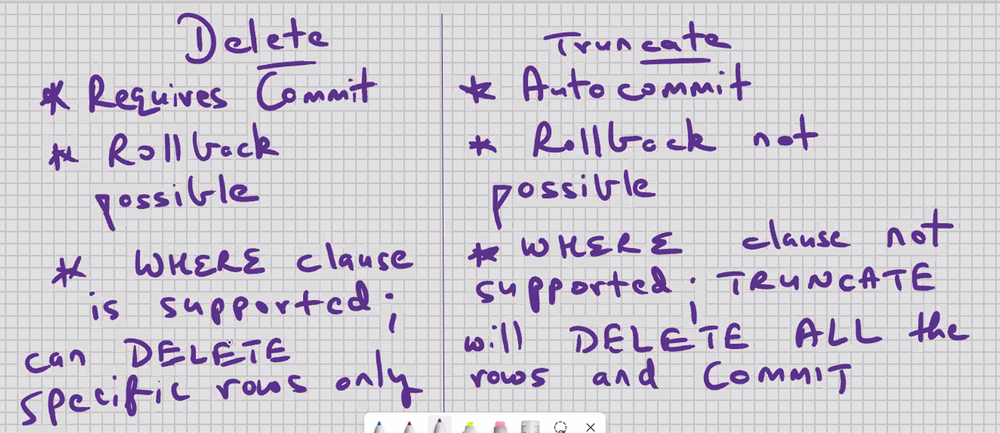
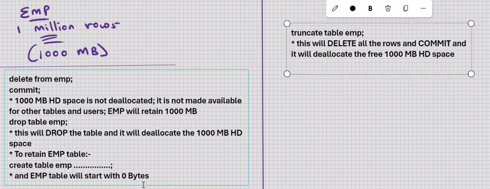
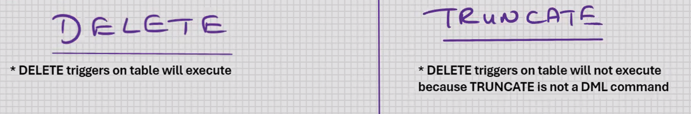

# DBT Day8-16-10-2024

after 3.6

- Reduce width of column
  In Oracle:-

```sql
alter table emp modify ename varchar(20); --ERROR
```

- In Oracle, you can reduce the width provided the contents are null

```sql
alter table emp add x varchar(25);
update emp set x = ename, ename = null;
alter table emp modify ename varchar(20);
-- Data testing with X column; check that none of the names > 20 chars
update emp set ename =x;
alter table emp drop column x;
```

- IT'S RECOMMENDED YOU USE ABOVE SOLUTION FOR MySQL
  



- Copy the rows from one table into another table
  

```sql
insert into emp_kh select * from emp_jh;
```

- above command will work provided the structure of both the tables is the same

To copy specific rows ONLY:-

```sql
insert into emp_kh
select * from emp_jh where .........;

e.g.
insert into emp_kh
select * from emp_jh where deptno =1 ;
```

- Copy a table (for testing purposes)
  

```sql
create table emp2
as
select * from emp;
```

1. it will create table emp2 as per structure of SELECT statement
2. SELECT statement will be executed

- When you CREATE TABLE using sub-query, indexes on original table are not copied into the new table
- if you want indexes on the new table, you will have to create them manually

```sql
create table emp2
as
select * from emp;
```

To copy specific rows/columns ONLY:-

```sql
create table emp2
as
select empne, ename from emp where............;
```

- Copy ONLY the structure of the table
  Solution #1:-

```sql
create table emp2
as
select * from emp;
delete from emp2;
commit;
```

---

Solution #2:-

```sql
create table emp2
as
select * from emp;
truncate table emp2;
```

- TRUNCATE is a DDL command
- TRUNCATE will DELETE ALL the rows and commlT






- Rename a column

```sql
create table emp2
as
select empno, ename, sal salary
from emp;

drop table emp;
rename table emp2 to emp;
```

- Change the position of columns in table structure (because of null values, for storage considerations)

```sql
create table emp2
as
select ename, sal, empno from emp;

drop table emp;
rename table emp2 to emp;
```
