## Day9-17-10-2024

# MySQL - SQL - CONSTRAINTS (5)

Primary key, Not null, Unique, Foreign key
CHECK

- used for validations (used for checking purposes)
- e.g. sal < l000, age > 25 etc.

after 3.41
To avoid the problem of missing numbers:-

- Do not issue the INSERT statements to the database at the time of data entry; when user does the data entry, you store the rows in an array; when user issues a Commit, you issue the INSERT statements to the database followed by COMMIT

## MySQL - SQL - PRIVILEGES

Grant and Revoke (DCL)I
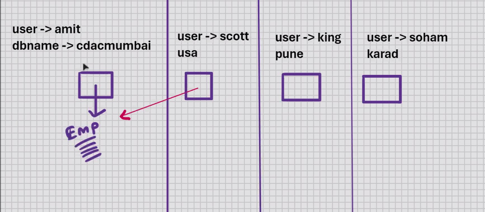

```sql
-- root means root user is typing command
root_mysql> grant select on cdacmumbai.emp to scott@localhost;

cdacmumbai.emp -> dbname.tablename
cdacmumbai.emp -> schemaname.tablename

-- here commit is not needed

root_mysql> grant select on cdacmumbai.emp to scott@localhost;
root_mysql> grant insert on cdacmumbai.emp to scott@localhost;
root_mysql> grant update on cdacmumbai.emp to scott@localhost;
root_mysql> grant delete on cdacmumbai.emp to scott@localhost;
-- droping (drop table) can only root and owner user do
root_mysql> grant select, insert on cdacmumbai.emp to scott@localhost;
root_mysql> grant all privileges on cdacmumbai.emp to scott@localhost;

root_mysql> grant select on cdacmumbai.emp to
scott@localhost, king@localhost;
root_mysql> grant select on cdacmumbai.emp to public; -- public means all users

--once we grant then premisions are it is permanant, we can revoke it later
```

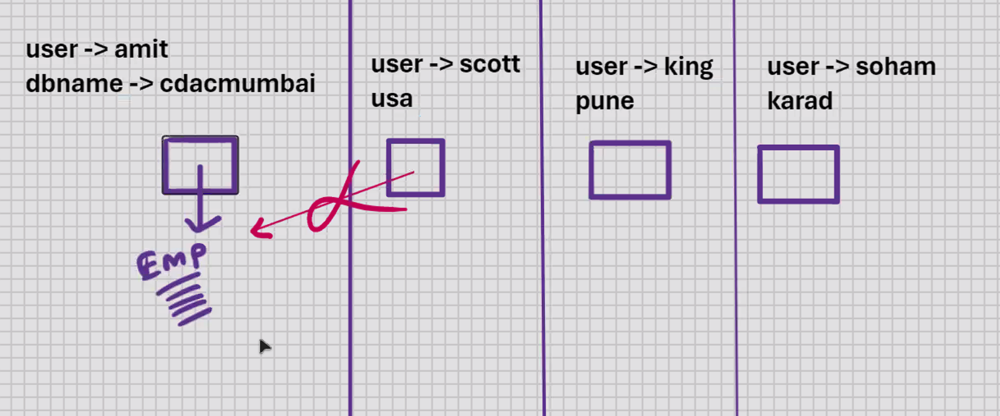

```sql
root_mysql> revoke select on cdacmumbai.emp from scott@localhost;
root_mysql> revoke select on cdacmumbai.emp from public;

```

```sql
select * from information_schema.table_privileges; -- to see what permisions granted
```

- SCHEMA IS A SYNONYM FOR DATABASE

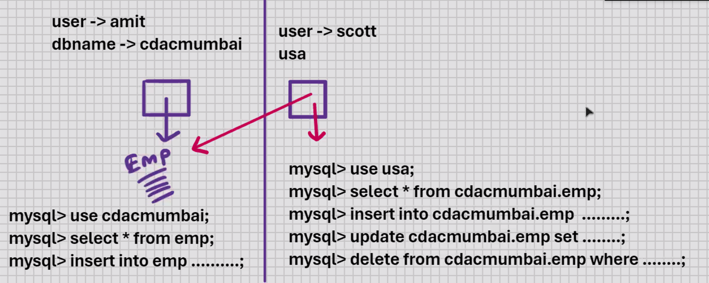

```sql
root_mysql> create user amit@localhost identified by 'student' ;
root_mysql> create user amit@'%' identified by 'student' ;

root_mysql> create user amit@'d%' identified by 'student' ;

root_mysql> grant all privileges on cdacmumbai.* to amit@localhost;
root_mysql> grant all privileges on cdacmumbai.* to amit@'%';
root_mysql> grant all privileges on cdacmumbai.* to amit@'d%' ; -- can connect/access databases which start with d.
```

## MySQL - System tables

- MySQL created
- automatically created when you install MySQL
- 78 System tables in MySQL v9
- set of System tables is also known as DATABASE CATALOG
- set of System tables is also known as DATA DICTIONARY
- stored in information_schema
- System tables store complete information about the database
- e.g. statistics (for indexes), table_constraints, key_column_usage, table_privileges, etc.
  DBA -> Database Administrator
- all the system tables are READ_ONLY
- DDL FOR USER IS DML FOR SYSTEM TABLES

Login as root user:-

```sql
mysql> use information_schema;
mysql> show tables;
```

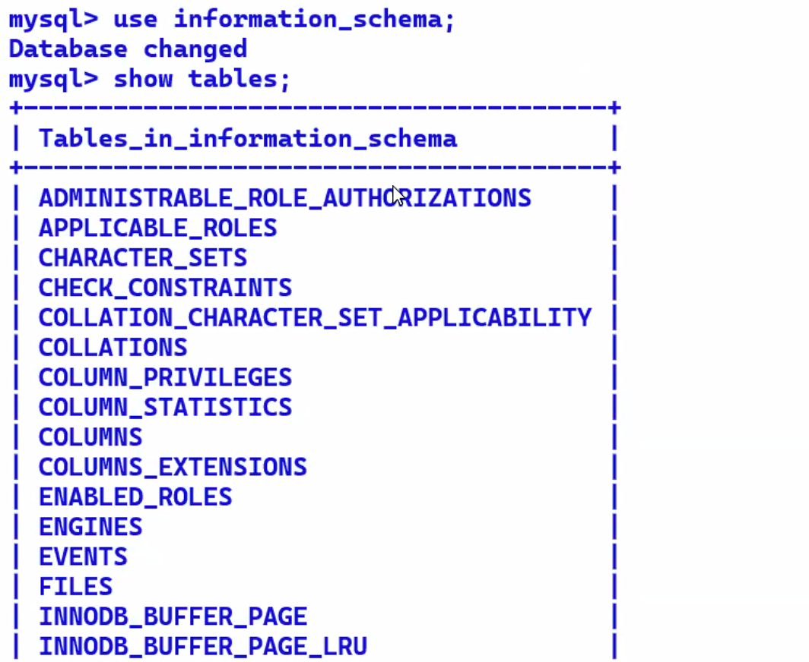

Data is of 2 types:-

1. User data

- user created
- user tables and indexes

2. System data (Metadata)

- MySQL created
- data is stored in System tables
- also known as Metadata (data about data)

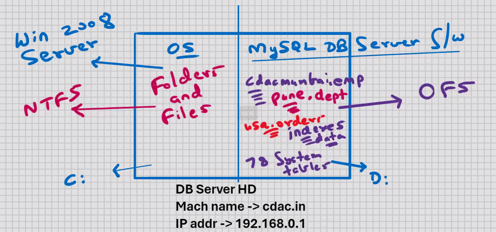
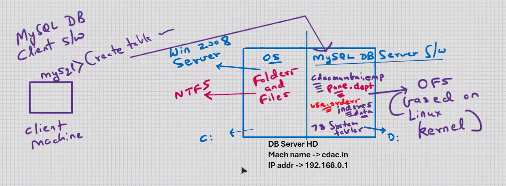

## MySQL - STORED OBJECTS

- objects that are stored in the database
- e.g. CREATE....... tables, indexes
- anything that you do with CREATE command is a stored object

## VIEWS

- present in all RDBMS and some of the DBMS
- view is a handle to a table
- stores the address of the table
- view is a HD pointer (stores the address of the table) (known as LOCATOR)
- used for indirect access to the table
- used for SECURITY purposes
- used to restrict the users

```sql
mysql> create view viewname.........;

amit_mysql> create view vl
                as
                select empno, ename from emp;
                View created.
```

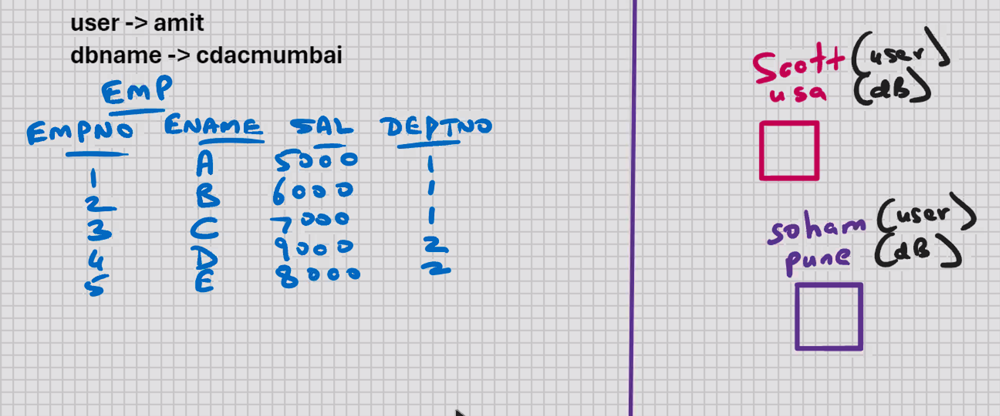

```sql
root_mysql> grant select on cdacmumbai.v1 to scott@localhost;

scott_mysql> select * cdacmumbai.emp; -- ERROR
scott_mysql> select * cdacmumbai.v1;
```

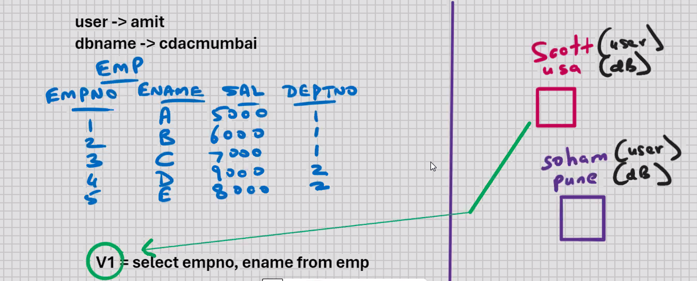

```sql
scott_mysql> select * cdacmumbai.v1;
```

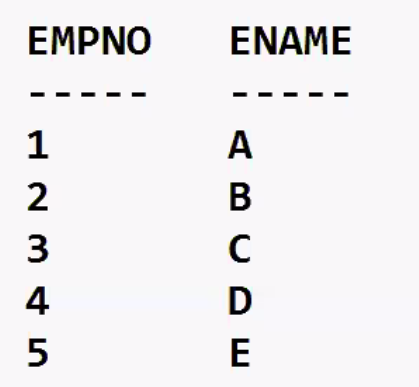

- used to restrict the column access
- VIEW DOES NOT CONTAIN DATA
- only the definition is stored; data is not stored ;defination means select statement on which is based
- view is a stored query (stored in the database)
- SELECT statemment on which the view is based, it is stored in the DB in the COMPILED FORMAT
- view is an executable format of SELECT statement
- hence the execution will be very fast
- hiding source code from end user

```sql
amit_mysql> create view v1
                    as
                    select empno, ename from emp;

root_mysql> grant select, insert on cdacmumbai.v1 to scott@localhost;
```

```sql
scott_mysql> insert into cdacmumbai.vl values(6, 'F');
```

- DML operations can be performed on a view
- DML operations done on a view will affect the base table
- Constraints that are specified on the table will enforced even when you insert via the view
- ENTIRE APPLICATION IS BASED ON VIEWS

```sql

amit_mysql> create view v1
                    as
                    select empno, ename from emp;
amit_mysql> drop view v1;
```

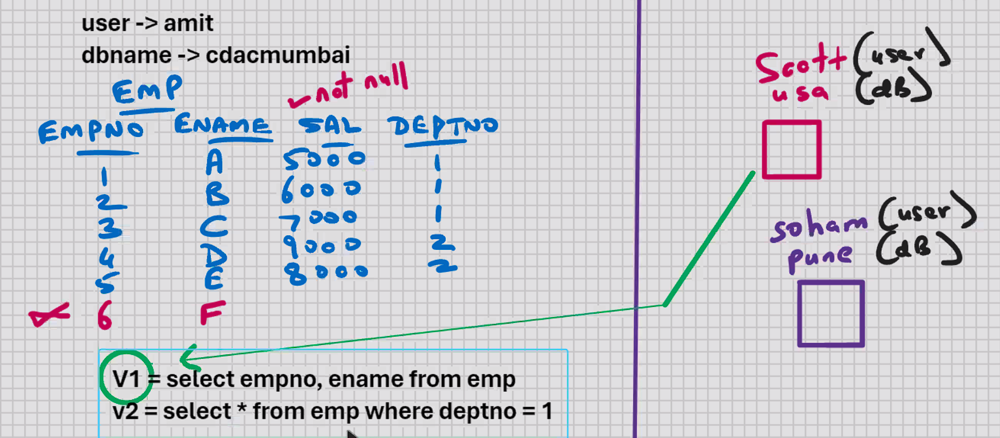

```sql
create view v2
as
select * from emp where deptno = 1;

select * from v2;

```

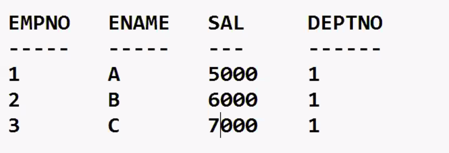

- used to restrict the row access

```sql
create view v2
as
select * from emp where deptno = 1;
insert into v2 values(6, 'F', 6000, 2); -- IT WILL ALLOW

```

```sql
create view v2
as
select * from emp where deptno = 1 with check option; -- BY THIS WE CAN ENTER IN DEPT ONE ONLY
insert into v2 values(6, 'F', 6000, 2); -- ERROR

```

- view with check option is similar to check constraint
- used to enforce different checks for different users

to change the SELECT statement of the view:-

```sql
drop view VI;
create view v1 as ......................;

create or replace view v1
as
select ename, sal, from emp;
```

```sql
show tables; --will show tables and views but it won't tell you which is a table and which is a view
```

To find out which is a table and which is a view:-

```sql
show full tables;
desc emp;
desc v1;
```

```sql
create or replace view v1
as
select ename, sal*12 "annual" from emp;
select * from v1;
```

```sql
create or replace view v1
as
select upper(ename) "u_ename" , sal*12 "annual" from emp;
select * from v1;
```

- view based on computed column, expression, function, order by clause, group by clause, etc.
- you can SELECT from this view
- DML operations are not allowed
- common for all RDBMS

```sql
create or replace view v1
as
select dname, ename from emp, dept
where dept.deptno = emp.deptno;
select * from v1;
```

- view based on join, sub-query, UNION, etc.
- you can SELECT from this view
- DML operations are not allowed
- common for all RDBMS

To see the SELECT statement on which the view is based:-

```sql
show create view v1;
--output:
V1 = select.................;
V2 = select.................;
```

- view based on view is allowed
- Uses:-

### To exceed the limits of SQL:-

1. UNION > 255 SELECT statements
2. Sub-query > 255 levels
3. Function within function > 255 levels

### To simplify the writing of complex SELECT statements

1. Join of 40 tables

- complex queries can be stored in view definition
